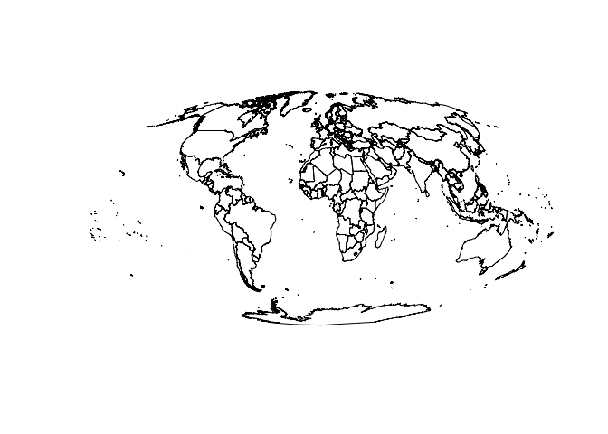
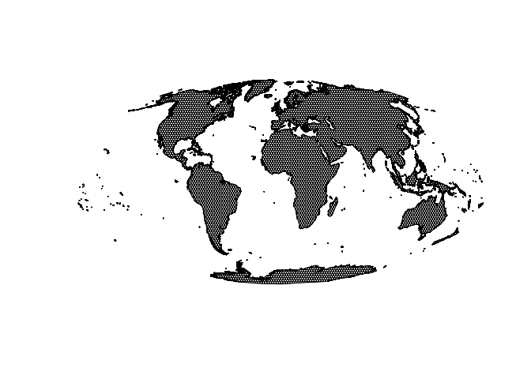

Create hexagonal global grid
================
Ate Poorthuis
02/09/2019

Create hexagonal global grid
----------------------------

We start by reading in country-level data from Natural Earth. The end-goal is to create a global hexagonal grid with cells of 200km. Cells should be neatly clipped to the land boundaries.

``` r
countries <- read_sf(here("analysis/data/raw_data/ne_50m_admin_0_countries/")) %>% 
  st_transform(crs = "+proj=moll +lon_0=0 +x_0=0 +y_0=0 +ellps=WGS84 +datum=WGS84 +units=m +no_defs")
plot(st_geometry(countries))
```



``` r
hexagons <- countries %>% 
  st_buffer(400000) %>% 
  st_make_grid(cellsize = 200000, square = F) %>% 
  st_sf() %>% 
  rowid_to_column("hex")

hexagons_clipped <- countries %>% 
  st_buffer(100) %>% 
  st_intersection(hexagons) %>% 
  select(hex) %>% 
  group_by(hex) %>% 
  summarise()
```

    ## Warning: attribute variables are assumed to be spatially constant
    ## throughout all geometries

``` r
plot(st_geometry(hexagons_clipped))
```



The resulting grids are saved in `analysis/data/derived_data`.

``` r
st_write(hexagons_clipped, here("analysis/data/derived_data/global_hex_grid.geojson"), delete_dsn = T)
```

    ## Deleting source `/Users/ate/Documents/geographyoffashion/analysis/data/derived_data/global_hex_grid.geojson' using driver `GeoJSON'
    ## Writing layer `global_hex_grid' to data source `/Users/ate/Documents/geographyoffashion/analysis/data/derived_data/global_hex_grid.geojson' using driver `GeoJSON'
    ## features:       5643
    ## fields:         1
    ## geometry type:  Unknown (any)

``` r
saveRDS(hexagons_clipped, here("analysis/data/derived_data/global_hex_grid.rds"))
```
