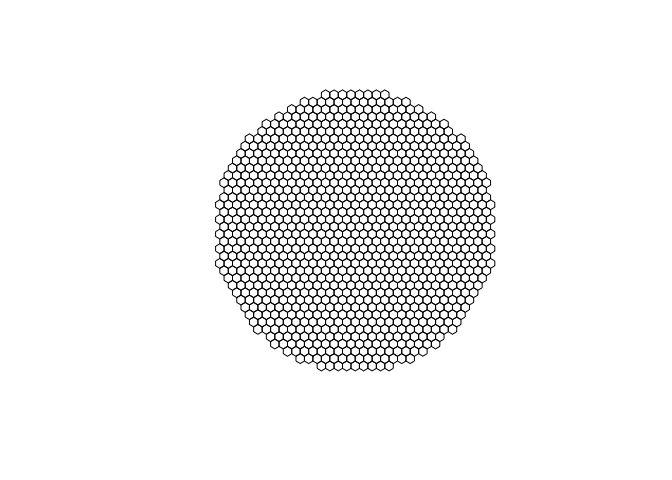

Create city-level data
================
Ate Poorthuis
26/10/2019

Create hexagonal city grid.
---------------------------

We start by reading in a shapefile containing the centroid of 10 cities: NY, London, Paris, Milan, Singapore, Frankfurt, Warsaw, Minneapolis, Capetown, Sao Paulo, and Sydney. We then create a 40km buffer around each centroid.

``` r
cities <- read_sf(here("analysis/data/raw_data/cities/")) %>% 
  st_transform(crs = "+proj=moll +lon_0=0 +x_0=0 +y_0=0 +ellps=WGS84 +datum=WGS84 +units=m +no_defs") %>% 
  st_buffer(40000)
plot(st_geometry(cities))
```


``` r
cities_list <- cities %>% pull(city)

create_hexagons <- function(index) {
  city_name <- cities_list[[index]]
  cities[index,] %>% 
    st_make_grid(cellsize = 2500, square = F) %>% 
    st_sf() %>% 
    rowid_to_column("id") %>% 
    mutate(hex = paste(city_name, id, sep = "-"),
           city = city_name)
}

hexagons_per_city <- lapply(seq_along(cities_list), create_hexagons)
plot(st_geometry(hexagons_per_city[[1]]))
```



``` r
hexagons <- do.call(rbind, hexagons_per_city) # bind all city buffers together into single sf object
```

The resulting grids are saved in `analysis/data/derived_data`.

``` r
st_write(hexagons, here("analysis/data/derived_data/cities_hex_grid.geojson"), delete_dsn = T)
```

    ## Deleting source `/Users/ate/Documents/geographyoffashion/analysis/data/derived_data/cities_hex_grid.geojson' using driver `GeoJSON'
    ## Writing layer `cities_hex_grid' to data source `/Users/ate/Documents/geographyoffashion/analysis/data/derived_data/cities_hex_grid.geojson' using driver `GeoJSON'
    ## features:       10923
    ## fields:         3
    ## geometry type:  Polygon

``` r
saveRDS(hexagons, here("analysis/data/derived_data/cities_hex_grid.rds"))
```

Spatial join between tweets and hexagon grid
--------------------------------------------

Start by reading in the random sample of tweets as well as the clipped hexagons that we created in the previous step. To join tweets to hexagons, we use `reversegeocoder` (<https://github.com/atepoorthuis/reversegeocoder>) instead of the conventional `sf::st_join` because it is ~10x faster for this particular scenario.

``` r
hexagons_clipped <- readRDS(here("analysis/data/derived_data/cities_hex_grid.rds"))
random_tweets <- fread(here("analysis/data/raw_data/twitter/random-sample/fashion-random-cities.csv"), select = c("id", "lon", "lat", "created_at", "u_followers_count")) %>% 
  st_as_sf(coords = c("lon", "lat"), crs = 4326) %>% 
  st_transform(st_crs(hexagons_clipped))

hexagons_geojson <- geojson_list(hexagons_clipped) %>% unclass()
ctx <- reversegeocoder::rg_load_polygons(hexagons_geojson)

random_tweets$hex <-reversegeocoder::rg_batch_query(ctx, random_tweets %>% st_coordinates(), "hex")

hexagons_joined <- random_tweets %>% 
  st_set_geometry(NULL) %>% 
  group_by(hex) %>% 
  summarise(random = n(), random_fol = sum(u_followers_count)) %>% 
  right_join(., hexagons_clipped, by = "hex")
hexagons_joined[1:5,]
```

    ## # A tibble: 5 x 6
    ##   hex     random random_fol    id city                             geometry
    ##   <chr>    <int>      <int> <int> <chr>                       <POLYGON [m]>
    ## 1 New Yo…     NA         NA     1 New … ((-6248740 4836101, -6247490 48368…
    ## 2 New Yo…     NA         NA     2 New … ((-6246240 4836101, -6244990 48368…
    ## 3 New Yo…     NA         NA     3 New … ((-6243740 4836101, -6242490 48368…
    ## 4 New Yo…     NA         NA     4 New … ((-6241240 4836101, -6239990 48368…
    ## 5 New Yo…     NA         NA     5 New … ((-6238740 4836101, -6237490 48368…

We repeat the join to hexagon procedure for each query in our data. Unfortunately, due to Twitter's T&C we cannot share this raw data here.

``` r
file_names <- dir(here("analysis/data/raw_data/twitter/fashion/"), pattern =".*csv", full.names = T)


join_to_grid <- function(file, hexagons) {
  name <- file %>% 
    basename() %>% 
    gsub(pattern = ".csv", replacement = "")
  name_fol <- paste0(name, "_fol")

  tweets <- fread(file, select = c("id", "lon", "lat", "created_at", "u_followers_count")) %>% 
    st_as_sf(coords = c("lon", "lat"), crs = 4326) %>% 
    st_transform(st_crs(hexagons_clipped))
  tweets$hex <-reversegeocoder::rg_batch_query(ctx, tweets %>% st_coordinates(), "hex")
  tweets <- tweets %>% 
    filter(!is.na(hex))
  
  if (nrow(tweets) > 0) {
    joined <- tweets %>% 
      st_set_geometry(NULL) %>% 
      group_by(hex) %>% 
      summarise(!!name := n(), !!name_fol := sum(u_followers_count)) %>% 
      right_join(., hexagons, by = "hex")
    invisible(joined)
  } else {
    invisible(hexagons)
  }
}

join_with_side_effects <- function(f) {
  hexagons_joined <<- join_to_grid(f, hexagons_joined)
  invisible(basename(f))
}

pblapply(file_names, function(f) join_with_side_effects(f))
```

    ## [[1]]
    ## [1] "Associated_companies-001.csv"
    ## 
    ## [[2]]
    ## [1] "Associated_companies-002.csv"
    ## 
    ## [[3]]
    ## [1] "Associated_companies-003.csv"
    ## 
    ## [[4]]
    ## [1] "Associated_companies-004.csv"
    ## 
    ## [[5]]
    ## [1] "Associated_companies-005.csv"
    ## 
    ## [[6]]
    ## [1] "Associated_companies-006.csv"
    ## 
    ## [[7]]
    ## [1] "Associated_companies-007.csv"
    ## 
    ## [[8]]
    ## [1] "Associated_companies-008.csv"
    ## 
    ## [[9]]
    ## [1] "Associated_companies-009.csv"
    ## 
    ## [[10]]
    ## [1] "Associated_companies-010.csv"
    ## 
    ## [[11]]
    ## [1] "Associated_companies-011.csv"
    ## 
    ## [[12]]
    ## [1] "Associated_companies-012.csv"
    ## 
    ## [[13]]
    ## [1] "Associated_companies-013.csv"
    ## 
    ## [[14]]
    ## [1] "Associated_companies-014.csv"
    ## 
    ## [[15]]
    ## [1] "Associated_companies-015.csv"
    ## 
    ## [[16]]
    ## [1] "Associated_companies-016.csv"
    ## 
    ## [[17]]
    ## [1] "Associated_companies-017.csv"
    ## 
    ## [[18]]
    ## [1] "Associated_companies-018.csv"
    ## 
    ## [[19]]
    ## [1] "Associated_companies-019.csv"
    ## 
    ## [[20]]
    ## [1] "Associated_companies-020.csv"
    ## 
    ## [[21]]
    ## [1] "Associated_companies-022.csv"
    ## 
    ## [[22]]
    ## [1] "Associated_companies-024.csv"
    ## 
    ## [[23]]
    ## [1] "Associated_companies-025.csv"
    ## 
    ## [[24]]
    ## [1] "Associated_companies-027.csv"
    ## 
    ## [[25]]
    ## [1] "Associated_companies-028.csv"
    ## 
    ## [[26]]
    ## [1] "Associated_companies-030.csv"
    ## 
    ## [[27]]
    ## [1] "Associated_companies-032.csv"
    ## 
    ## [[28]]
    ## [1] "Associated_companies-033.csv"
    ## 
    ## [[29]]
    ## [1] "Associated_companies-034.csv"
    ## 
    ## [[30]]
    ## [1] "Associated_companies-035.csv"
    ## 
    ## [[31]]
    ## [1] "Associated_companies-036.csv"
    ## 
    ## [[32]]
    ## [1] "Associated_companies-037.csv"
    ## 
    ## [[33]]
    ## [1] "Associated_companies-038.csv"
    ## 
    ## [[34]]
    ## [1] "Associated_companies-039.csv"
    ## 
    ## [[35]]
    ## [1] "Associated_companies-040.csv"
    ## 
    ## [[36]]
    ## [1] "Associated_companies-042.csv"
    ## 
    ## [[37]]
    ## [1] "Associated_companies-043.csv"
    ## 
    ## [[38]]
    ## [1] "Associated_companies-044.csv"
    ## 
    ## [[39]]
    ## [1] "Associated_companies-045.csv"
    ## 
    ## [[40]]
    ## [1] "Associated_companies-046.csv"
    ## 
    ## [[41]]
    ## [1] "Associated_companies-047.csv"
    ## 
    ## [[42]]
    ## [1] "Associated_companies-048.csv"
    ## 
    ## [[43]]
    ## [1] "Associated_companies-049.csv"
    ## 
    ## [[44]]
    ## [1] "Associated_companies-050.csv"
    ## 
    ## [[45]]
    ## [1] "Associated_companies-051.csv"
    ## 
    ## [[46]]
    ## [1] "Associated_companies-052.csv"
    ## 
    ## [[47]]
    ## [1] "Associated_companies-053.csv"
    ## 
    ## [[48]]
    ## [1] "Associated_companies-055.csv"
    ## 
    ## [[49]]
    ## [1] "Associated_companies-056.csv"
    ## 
    ## [[50]]
    ## [1] "Associated_companies-057.csv"
    ## 
    ## [[51]]
    ## [1] "Associated_companies-058.csv"
    ## 
    ## [[52]]
    ## [1] "Associated_companies-059.csv"
    ## 
    ## [[53]]
    ## [1] "Associated_companies-061.csv"
    ## 
    ## [[54]]
    ## [1] "Associated_companies-062.csv"
    ## 
    ## [[55]]
    ## [1] "Associated_companies-063.csv"
    ## 
    ## [[56]]
    ## [1] "Associated_companies-064.csv"
    ## 
    ## [[57]]
    ## [1] "Associated_companies-065.csv"
    ## 
    ## [[58]]
    ## [1] "Associated_companies-067.csv"
    ## 
    ## [[59]]
    ## [1] "Associated_companies-068.csv"
    ## 
    ## [[60]]
    ## [1] "Associated_companies-069.csv"
    ## 
    ## [[61]]
    ## [1] "Associated_companies-070.csv"
    ## 
    ## [[62]]
    ## [1] "Associated_companies-071.csv"
    ## 
    ## [[63]]
    ## [1] "Associated_companies-072.csv"
    ## 
    ## [[64]]
    ## [1] "Associated_companies-073.csv"
    ## 
    ## [[65]]
    ## [1] "Associated_companies-074.csv"
    ## 
    ## [[66]]
    ## [1] "Associated_companies-075.csv"
    ## 
    ## [[67]]
    ## [1] "Associated_companies-076.csv"
    ## 
    ## [[68]]
    ## [1] "Associated_companies-079.csv"
    ## 
    ## [[69]]
    ## [1] "Associated_companies-080.csv"
    ## 
    ## [[70]]
    ## [1] "Associated_companies-081.csv"
    ## 
    ## [[71]]
    ## [1] "Associated_companies-083.csv"
    ## 
    ## [[72]]
    ## [1] "Associated_companies-084.csv"
    ## 
    ## [[73]]
    ## [1] "Associated_companies-086.csv"
    ## 
    ## [[74]]
    ## [1] "Associated_companies-087.csv"
    ## 
    ## [[75]]
    ## [1] "Associated_companies-088.csv"
    ## 
    ## [[76]]
    ## [1] "Associated_companies-089.csv"
    ## 
    ## [[77]]
    ## [1] "associated_companies-090.csv"
    ## 
    ## [[78]]
    ## [1] "Associated_companies-091.csv"
    ## 
    ## [[79]]
    ## [1] "Associated_companies-092.csv"
    ## 
    ## [[80]]
    ## [1] "Associated_companies-093.csv"
    ## 
    ## [[81]]
    ## [1] "Associated_companies-094.csv"
    ## 
    ## [[82]]
    ## [1] "Associated_companies-095.csv"
    ## 
    ## [[83]]
    ## [1] "Associated_companies-096.csv"
    ## 
    ## [[84]]
    ## [1] "Associated_companies-097.csv"
    ## 
    ## [[85]]
    ## [1] "Associated_companies-098.csv"
    ## 
    ## [[86]]
    ## [1] "Associated_companies-099.csv"
    ## 
    ## [[87]]
    ## [1] "Associated_companies-100.csv"
    ## 
    ## [[88]]
    ## [1] "Associated_companies-101.csv"
    ## 
    ## [[89]]
    ## [1] "Associated_companies-102.csv"
    ## 
    ## [[90]]
    ## [1] "Associated_companies-103.csv"
    ## 
    ## [[91]]
    ## [1] "Catalysts-002.csv"
    ## 
    ## [[92]]
    ## [1] "Catalysts-003.csv"
    ## 
    ## [[93]]
    ## [1] "Catalysts-005.csv"
    ## 
    ## [[94]]
    ## [1] "Catalysts-006.csv"
    ## 
    ## [[95]]
    ## [1] "Catalysts-007.csv"
    ## 
    ## [[96]]
    ## [1] "Catalysts-008.csv"
    ## 
    ## [[97]]
    ## [1] "Catalysts-009.csv"
    ## 
    ## [[98]]
    ## [1] "Catalysts-010.csv"
    ## 
    ## [[99]]
    ## [1] "Catalysts-011.csv"
    ## 
    ## [[100]]
    ## [1] "Catalysts-012.csv"
    ## 
    ## [[101]]
    ## [1] "Catalysts-013.csv"
    ## 
    ## [[102]]
    ## [1] "Catalysts-015.csv"
    ## 
    ## [[103]]
    ## [1] "Catalysts-016.csv"
    ## 
    ## [[104]]
    ## [1] "Catalysts-017.csv"
    ## 
    ## [[105]]
    ## [1] "Catalysts-018.csv"
    ## 
    ## [[106]]
    ## [1] "Catalysts-019.csv"
    ## 
    ## [[107]]
    ## [1] "Catalysts-020.csv"
    ## 
    ## [[108]]
    ## [1] "Catalysts-021.csv"
    ## 
    ## [[109]]
    ## [1] "Catalysts-022.csv"
    ## 
    ## [[110]]
    ## [1] "Catalysts-023.csv"
    ## 
    ## [[111]]
    ## [1] "Catalysts-024.csv"
    ## 
    ## [[112]]
    ## [1] "Catalysts-025.csv"
    ## 
    ## [[113]]
    ## [1] "Catalysts-027.csv"
    ## 
    ## [[114]]
    ## [1] "Catalysts-029.csv"
    ## 
    ## [[115]]
    ## [1] "Catalysts-031.csv"
    ## 
    ## [[116]]
    ## [1] "Catalysts-032.csv"
    ## 
    ## [[117]]
    ## [1] "Catalysts-033.csv"
    ## 
    ## [[118]]
    ## [1] "Catalysts-034.csv"
    ## 
    ## [[119]]
    ## [1] "Catalysts-035.csv"
    ## 
    ## [[120]]
    ## [1] "Catalysts-036.csv"
    ## 
    ## [[121]]
    ## [1] "Catalysts-038.csv"
    ## 
    ## [[122]]
    ## [1] "Catalysts-039.csv"
    ## 
    ## [[123]]
    ## [1] "Catalysts-040.csv"
    ## 
    ## [[124]]
    ## [1] "Catalysts-042.csv"
    ## 
    ## [[125]]
    ## [1] "Catalysts-044.csv"
    ## 
    ## [[126]]
    ## [1] "Catalysts-045.csv"
    ## 
    ## [[127]]
    ## [1] "Catalysts-046.csv"
    ## 
    ## [[128]]
    ## [1] "Catalysts-047.csv"
    ## 
    ## [[129]]
    ## [1] "Catalysts-048.csv"
    ## 
    ## [[130]]
    ## [1] "Catalysts-049.csv"
    ## 
    ## [[131]]
    ## [1] "Catalysts-050.csv"
    ## 
    ## [[132]]
    ## [1] "Catalysts-051.csv"
    ## 
    ## [[133]]
    ## [1] "Catalysts-052.csv"
    ## 
    ## [[134]]
    ## [1] "Catalysts-053.csv"
    ## 
    ## [[135]]
    ## [1] "Catalysts-054.csv"
    ## 
    ## [[136]]
    ## [1] "Catalysts-055.csv"
    ## 
    ## [[137]]
    ## [1] "Catalysts-056.csv"
    ## 
    ## [[138]]
    ## [1] "Catalysts-057.csv"
    ## 
    ## [[139]]
    ## [1] "Catalysts-058.csv"
    ## 
    ## [[140]]
    ## [1] "Catalysts-059.csv"
    ## 
    ## [[141]]
    ## [1] "Catalysts-060.csv"
    ## 
    ## [[142]]
    ## [1] "Catalysts-061.csv"
    ## 
    ## [[143]]
    ## [1] "Catalysts-062.csv"
    ## 
    ## [[144]]
    ## [1] "Catalysts-063.csv"
    ## 
    ## [[145]]
    ## [1] "Catalysts-064.csv"
    ## 
    ## [[146]]
    ## [1] "Catalysts-065.csv"
    ## 
    ## [[147]]
    ## [1] "Catalysts-067.csv"
    ## 
    ## [[148]]
    ## [1] "Catalysts-II-001.csv"
    ## 
    ## [[149]]
    ## [1] "Catalysts-II-002.csv"
    ## 
    ## [[150]]
    ## [1] "Catalysts-II-003.csv"
    ## 
    ## [[151]]
    ## [1] "Catalysts-II-004.csv"
    ## 
    ## [[152]]
    ## [1] "Catalysts-II-005.csv"
    ## 
    ## [[153]]
    ## [1] "Catalysts-II-006.csv"
    ## 
    ## [[154]]
    ## [1] "Catalysts-II-007.csv"
    ## 
    ## [[155]]
    ## [1] "Catalysts-II-008.csv"
    ## 
    ## [[156]]
    ## [1] "Catalysts-II-009.csv"
    ## 
    ## [[157]]
    ## [1] "Catalysts-II-010.csv"
    ## 
    ## [[158]]
    ## [1] "Catalysts-II-011.csv"
    ## 
    ## [[159]]
    ## [1] "Catalysts-II-012.csv"
    ## 
    ## [[160]]
    ## [1] "Catalysts-II-013.csv"
    ## 
    ## [[161]]
    ## [1] "Catalysts-II-014.csv"
    ## 
    ## [[162]]
    ## [1] "Catalysts-II-015.csv"
    ## 
    ## [[163]]
    ## [1] "Catalysts-II-017.csv"
    ## 
    ## [[164]]
    ## [1] "Catalysts-II-018.csv"
    ## 
    ## [[165]]
    ## [1] "Catalysts-II-019.csv"
    ## 
    ## [[166]]
    ## [1] "Catalysts-II-020.csv"
    ## 
    ## [[167]]
    ## [1] "Catalysts-II-021.csv"
    ## 
    ## [[168]]
    ## [1] "Catalysts-II-022.csv"
    ## 
    ## [[169]]
    ## [1] "Catalysts-II-023.csv"
    ## 
    ## [[170]]
    ## [1] "Catalysts-II-024.csv"
    ## 
    ## [[171]]
    ## [1] "Creatives-001.csv"
    ## 
    ## [[172]]
    ## [1] "Creatives-002.csv"
    ## 
    ## [[173]]
    ## [1] "Creatives-004.csv"
    ## 
    ## [[174]]
    ## [1] "Creatives-005.csv"
    ## 
    ## [[175]]
    ## [1] "Creatives-006.csv"
    ## 
    ## [[176]]
    ## [1] "Creatives-007.csv"
    ## 
    ## [[177]]
    ## [1] "Creatives-008.csv"
    ## 
    ## [[178]]
    ## [1] "Creatives-009.csv"
    ## 
    ## [[179]]
    ## [1] "Creatives-010.csv"
    ## 
    ## [[180]]
    ## [1] "Creatives-011.csv"
    ## 
    ## [[181]]
    ## [1] "Creatives-012.csv"
    ## 
    ## [[182]]
    ## [1] "Creatives-013.csv"
    ## 
    ## [[183]]
    ## [1] "Creatives-014.csv"
    ## 
    ## [[184]]
    ## [1] "Creatives-016.csv"
    ## 
    ## [[185]]
    ## [1] "Creatives-017.csv"
    ## 
    ## [[186]]
    ## [1] "Creatives-018.csv"
    ## 
    ## [[187]]
    ## [1] "Creatives-019.csv"
    ## 
    ## [[188]]
    ## [1] "Creatives-020.csv"
    ## 
    ## [[189]]
    ## [1] "Creatives-021.csv"
    ## 
    ## [[190]]
    ## [1] "Creatives-022.csv"
    ## 
    ## [[191]]
    ## [1] "Creatives-023.csv"
    ## 
    ## [[192]]
    ## [1] "Creatives-024.csv"
    ## 
    ## [[193]]
    ## [1] "Creatives-026.csv"
    ## 
    ## [[194]]
    ## [1] "Creatives-027.csv"
    ## 
    ## [[195]]
    ## [1] "Creatives-028.csv"
    ## 
    ## [[196]]
    ## [1] "Creatives-029.csv"
    ## 
    ## [[197]]
    ## [1] "Creatives-030.csv"
    ## 
    ## [[198]]
    ## [1] "Creatives-031.csv"
    ## 
    ## [[199]]
    ## [1] "Creatives-032.csv"
    ## 
    ## [[200]]
    ## [1] "Creatives-033.csv"
    ## 
    ## [[201]]
    ## [1] "Creatives-034.csv"
    ## 
    ## [[202]]
    ## [1] "Creatives-035.csv"
    ## 
    ## [[203]]
    ## [1] "Creatives-036.csv"
    ## 
    ## [[204]]
    ## [1] "Creatives-037.csv"
    ## 
    ## [[205]]
    ## [1] "Creatives-038.csv"
    ## 
    ## [[206]]
    ## [1] "Creatives-039.csv"
    ## 
    ## [[207]]
    ## [1] "Creatives-040.csv"
    ## 
    ## [[208]]
    ## [1] "Creatives-041.csv"
    ## 
    ## [[209]]
    ## [1] "Creatives-042.csv"
    ## 
    ## [[210]]
    ## [1] "Creatives-043.csv"
    ## 
    ## [[211]]
    ## [1] "Creatives-044.csv"
    ## 
    ## [[212]]
    ## [1] "Creatives-045.csv"
    ## 
    ## [[213]]
    ## [1] "Creatives-046.csv"
    ## 
    ## [[214]]
    ## [1] "Creatives-047.csv"
    ## 
    ## [[215]]
    ## [1] "Creatives-048.csv"
    ## 
    ## [[216]]
    ## [1] "Creatives-049.csv"
    ## 
    ## [[217]]
    ## [1] "Creatives-050.csv"
    ## 
    ## [[218]]
    ## [1] "Creatives-051.csv"
    ## 
    ## [[219]]
    ## [1] "Creatives-052.csv"
    ## 
    ## [[220]]
    ## [1] "Creatives-053.csv"
    ## 
    ## [[221]]
    ## [1] "Creatives-054.csv"
    ## 
    ## [[222]]
    ## [1] "Creatives-056.csv"
    ## 
    ## [[223]]
    ## [1] "Creatives-057.csv"
    ## 
    ## [[224]]
    ## [1] "Creatives-058.csv"
    ## 
    ## [[225]]
    ## [1] "Creatives-059.csv"
    ## 
    ## [[226]]
    ## [1] "Creatives-060.csv"
    ## 
    ## [[227]]
    ## [1] "Creatives-062.csv"
    ## 
    ## [[228]]
    ## [1] "Creatives-063.csv"
    ## 
    ## [[229]]
    ## [1] "Creatives-064.csv"
    ## 
    ## [[230]]
    ## [1] "Creatives-065.csv"
    ## 
    ## [[231]]
    ## [1] "Creatives-066.csv"
    ## 
    ## [[232]]
    ## [1] "Creatives-067.csv"
    ## 
    ## [[233]]
    ## [1] "Creatives-068.csv"
    ## 
    ## [[234]]
    ## [1] "Creatives-069.csv"
    ## 
    ## [[235]]
    ## [1] "Creatives-070.csv"
    ## 
    ## [[236]]
    ## [1] "Creatives-071.csv"
    ## 
    ## [[237]]
    ## [1] "Creatives-072.csv"
    ## 
    ## [[238]]
    ## [1] "Creatives-073.csv"
    ## 
    ## [[239]]
    ## [1] "Creatives-074.csv"
    ## 
    ## [[240]]
    ## [1] "Creatives-075.csv"
    ## 
    ## [[241]]
    ## [1] "Creatives-076.csv"
    ## 
    ## [[242]]
    ## [1] "Creatives-077.csv"
    ## 
    ## [[243]]
    ## [1] "Creatives-078.csv"
    ## 
    ## [[244]]
    ## [1] "Creatives-079.csv"
    ## 
    ## [[245]]
    ## [1] "Creatives-080.csv"
    ## 
    ## [[246]]
    ## [1] "Creatives-081.csv"
    ## 
    ## [[247]]
    ## [1] "Creatives-082.csv"
    ## 
    ## [[248]]
    ## [1] "Creatives-083.csv"
    ## 
    ## [[249]]
    ## [1] "Creatives-084.csv"
    ## 
    ## [[250]]
    ## [1] "Creatives-085.csv"
    ## 
    ## [[251]]
    ## [1] "Creatives-086.csv"
    ## 
    ## [[252]]
    ## [1] "Creatives-087.csv"
    ## 
    ## [[253]]
    ## [1] "Creatives-088.csv"
    ## 
    ## [[254]]
    ## [1] "Creatives-089.csv"
    ## 
    ## [[255]]
    ## [1] "Creatives-090.csv"
    ## 
    ## [[256]]
    ## [1] "Creatives-091.csv"
    ## 
    ## [[257]]
    ## [1] "Creatives-093.csv"
    ## 
    ## [[258]]
    ## [1] "Creatives-095.csv"
    ## 
    ## [[259]]
    ## [1] "Creatives-097.csv"
    ## 
    ## [[260]]
    ## [1] "Creatives-098.csv"
    ## 
    ## [[261]]
    ## [1] "Creatives-099.csv"
    ## 
    ## [[262]]
    ## [1] "Creatives-101.csv"
    ## 
    ## [[263]]
    ## [1] "Creatives-102.csv"
    ## 
    ## [[264]]
    ## [1] "Creatives-103.csv"
    ## 
    ## [[265]]
    ## [1] "Creatives-104.csv"
    ## 
    ## [[266]]
    ## [1] "Creatives-105.csv"
    ## 
    ## [[267]]
    ## [1] "Creatives-106.csv"
    ## 
    ## [[268]]
    ## [1] "Creatives-107.csv"
    ## 
    ## [[269]]
    ## [1] "Creatives-108.csv"
    ## 
    ## [[270]]
    ## [1] "Creatives-109.csv"
    ## 
    ## [[271]]
    ## [1] "Creatives-110.csv"
    ## 
    ## [[272]]
    ## [1] "Creatives-111.csv"
    ## 
    ## [[273]]
    ## [1] "Creatives-112.csv"
    ## 
    ## [[274]]
    ## [1] "Creatives-113.csv"
    ## 
    ## [[275]]
    ## [1] "Creatives-114.csv"
    ## 
    ## [[276]]
    ## [1] "Creatives-115.csv"
    ## 
    ## [[277]]
    ## [1] "Creatives-116.csv"
    ## 
    ## [[278]]
    ## [1] "Creatives-118.csv"
    ## 
    ## [[279]]
    ## [1] "Creatives-119.csv"
    ## 
    ## [[280]]
    ## [1] "Creatives-120.csv"
    ## 
    ## [[281]]
    ## [1] "Creatives-121.csv"
    ## 
    ## [[282]]
    ## [1] "Creatives-122.csv"
    ## 
    ## [[283]]
    ## [1] "Creatives-123.csv"
    ## 
    ## [[284]]
    ## [1] "Creatives-124.csv"
    ## 
    ## [[285]]
    ## [1] "Creatives-125.csv"
    ## 
    ## [[286]]
    ## [1] "Creatives-127.csv"
    ## 
    ## [[287]]
    ## [1] "Creatives-128.csv"
    ## 
    ## [[288]]
    ## [1] "Creatives-129.csv"
    ## 
    ## [[289]]
    ## [1] "Creatives-130.csv"
    ## 
    ## [[290]]
    ## [1] "Designers-002.csv"
    ## 
    ## [[291]]
    ## [1] "Designers-003.csv"
    ## 
    ## [[292]]
    ## [1] "Designers-004.csv"
    ## 
    ## [[293]]
    ## [1] "Designers-005.csv"
    ## 
    ## [[294]]
    ## [1] "Designers-006.csv"
    ## 
    ## [[295]]
    ## [1] "Designers-007.csv"
    ## 
    ## [[296]]
    ## [1] "Designers-008.csv"
    ## 
    ## [[297]]
    ## [1] "Designers-009.csv"
    ## 
    ## [[298]]
    ## [1] "Designers-010.csv"
    ## 
    ## [[299]]
    ## [1] "Designers-011.csv"
    ## 
    ## [[300]]
    ## [1] "Designers-012.csv"
    ## 
    ## [[301]]
    ## [1] "Designers-013.csv"
    ## 
    ## [[302]]
    ## [1] "Designers-014.csv"
    ## 
    ## [[303]]
    ## [1] "Designers-015.csv"
    ## 
    ## [[304]]
    ## [1] "Designers-016.csv"
    ## 
    ## [[305]]
    ## [1] "Designers-017.csv"
    ## 
    ## [[306]]
    ## [1] "Designers-018.csv"
    ## 
    ## [[307]]
    ## [1] "Designers-019.csv"
    ## 
    ## [[308]]
    ## [1] "Designers-020.csv"
    ## 
    ## [[309]]
    ## [1] "Designers-021.csv"
    ## 
    ## [[310]]
    ## [1] "Designers-023.csv"
    ## 
    ## [[311]]
    ## [1] "Designers-024.csv"
    ## 
    ## [[312]]
    ## [1] "Designers-025.csv"
    ## 
    ## [[313]]
    ## [1] "Designers-026.csv"
    ## 
    ## [[314]]
    ## [1] "Designers-027.csv"
    ## 
    ## [[315]]
    ## [1] "Designers-028.csv"
    ## 
    ## [[316]]
    ## [1] "Designers-029.csv"
    ## 
    ## [[317]]
    ## [1] "Designers-030.csv"
    ## 
    ## [[318]]
    ## [1] "Designers-031.csv"
    ## 
    ## [[319]]
    ## [1] "Designers-032.csv"
    ## 
    ## [[320]]
    ## [1] "Designers-033.csv"
    ## 
    ## [[321]]
    ## [1] "Designers-034.csv"
    ## 
    ## [[322]]
    ## [1] "Designers-035.csv"
    ## 
    ## [[323]]
    ## [1] "Designers-037.csv"
    ## 
    ## [[324]]
    ## [1] "Designers-038.csv"
    ## 
    ## [[325]]
    ## [1] "Designers-039.csv"
    ## 
    ## [[326]]
    ## [1] "Designers-040.csv"
    ## 
    ## [[327]]
    ## [1] "Designers-041.csv"
    ## 
    ## [[328]]
    ## [1] "Designers-042.csv"
    ## 
    ## [[329]]
    ## [1] "Designers-043.csv"
    ## 
    ## [[330]]
    ## [1] "Designers-044.csv"
    ## 
    ## [[331]]
    ## [1] "Designers-045.csv"
    ## 
    ## [[332]]
    ## [1] "Designers-046.csv"
    ## 
    ## [[333]]
    ## [1] "Designers-047.csv"
    ## 
    ## [[334]]
    ## [1] "Designers-048.csv"
    ## 
    ## [[335]]
    ## [1] "Designers-049.csv"
    ## 
    ## [[336]]
    ## [1] "Designers-050.csv"
    ## 
    ## [[337]]
    ## [1] "Designers-051.csv"
    ## 
    ## [[338]]
    ## [1] "Designers-052.csv"
    ## 
    ## [[339]]
    ## [1] "Designers-053.csv"
    ## 
    ## [[340]]
    ## [1] "Designers-054.csv"
    ## 
    ## [[341]]
    ## [1] "Designers-055.csv"
    ## 
    ## [[342]]
    ## [1] "Designers-056.csv"
    ## 
    ## [[343]]
    ## [1] "Designers-057.csv"
    ## 
    ## [[344]]
    ## [1] "Designers-058.csv"
    ## 
    ## [[345]]
    ## [1] "Designers-059.csv"
    ## 
    ## [[346]]
    ## [1] "Designers-060.csv"
    ## 
    ## [[347]]
    ## [1] "Designers-061.csv"
    ## 
    ## [[348]]
    ## [1] "Designers-062.csv"
    ## 
    ## [[349]]
    ## [1] "Designers-063.csv"
    ## 
    ## [[350]]
    ## [1] "Designers-064.csv"
    ## 
    ## [[351]]
    ## [1] "Designers-065.csv"
    ## 
    ## [[352]]
    ## [1] "Designers-066.csv"
    ## 
    ## [[353]]
    ## [1] "Designers-067.csv"
    ## 
    ## [[354]]
    ## [1] "Designers-068.csv"
    ## 
    ## [[355]]
    ## [1] "Designers-069.csv"
    ## 
    ## [[356]]
    ## [1] "Designers-070.csv"
    ## 
    ## [[357]]
    ## [1] "Designers-071.csv"
    ## 
    ## [[358]]
    ## [1] "Designers-073.csv"
    ## 
    ## [[359]]
    ## [1] "Designers-074.csv"
    ## 
    ## [[360]]
    ## [1] "Designers-075.csv"
    ## 
    ## [[361]]
    ## [1] "Designers-076.csv"
    ## 
    ## [[362]]
    ## [1] "Designers-077.csv"
    ## 
    ## [[363]]
    ## [1] "Designers-078.csv"
    ## 
    ## [[364]]
    ## [1] "Designers-079.csv"
    ## 
    ## [[365]]
    ## [1] "Designers-080.csv"
    ## 
    ## [[366]]
    ## [1] "Designers-081.csv"
    ## 
    ## [[367]]
    ## [1] "Designers-082.csv"
    ## 
    ## [[368]]
    ## [1] "Designers-084.csv"
    ## 
    ## [[369]]
    ## [1] "Designers-085.csv"
    ## 
    ## [[370]]
    ## [1] "Designers-086.csv"
    ## 
    ## [[371]]
    ## [1] "Designers-087.csv"
    ## 
    ## [[372]]
    ## [1] "Designers-088.csv"
    ## 
    ## [[373]]
    ## [1] "Designers-089.csv"
    ## 
    ## [[374]]
    ## [1] "Designers-091.csv"
    ## 
    ## [[375]]
    ## [1] "Designers-092.csv"
    ## 
    ## [[376]]
    ## [1] "Designers-093.csv"
    ## 
    ## [[377]]
    ## [1] "Designers-094.csv"
    ## 
    ## [[378]]
    ## [1] "Designers-095.csv"
    ## 
    ## [[379]]
    ## [1] "Designers-096.csv"
    ## 
    ## [[380]]
    ## [1] "Designers-097.csv"
    ## 
    ## [[381]]
    ## [1] "Designers-098.csv"
    ## 
    ## [[382]]
    ## [1] "Designers-100.csv"
    ## 
    ## [[383]]
    ## [1] "Designers-101.csv"
    ## 
    ## [[384]]
    ## [1] "Designers-102.csv"
    ## 
    ## [[385]]
    ## [1] "Designers-103.csv"
    ## 
    ## [[386]]
    ## [1] "Designers-104.csv"
    ## 
    ## [[387]]
    ## [1] "Designers-105.csv"
    ## 
    ## [[388]]
    ## [1] "Designers-106.csv"
    ## 
    ## [[389]]
    ## [1] "Designers-107.csv"
    ## 
    ## [[390]]
    ## [1] "Designers-108.csv"
    ## 
    ## [[391]]
    ## [1] "Designers-109.csv"
    ## 
    ## [[392]]
    ## [1] "Designers-111.csv"
    ## 
    ## [[393]]
    ## [1] "Designers-112.csv"
    ## 
    ## [[394]]
    ## [1] "Designers-113.csv"
    ## 
    ## [[395]]
    ## [1] "Designers-115.csv"
    ## 
    ## [[396]]
    ## [1] "Designers-116.csv"
    ## 
    ## [[397]]
    ## [1] "Designers-117.csv"
    ## 
    ## [[398]]
    ## [1] "Designers-118.csv"
    ## 
    ## [[399]]
    ## [1] "Designers-119.csv"
    ## 
    ## [[400]]
    ## [1] "Designers-120.csv"
    ## 
    ## [[401]]
    ## [1] "Designers-121.csv"
    ## 
    ## [[402]]
    ## [1] "Designers-122.csv"
    ## 
    ## [[403]]
    ## [1] "Designers-123.csv"
    ## 
    ## [[404]]
    ## [1] "Designers-124.csv"
    ## 
    ## [[405]]
    ## [1] "Designers-125.csv"
    ## 
    ## [[406]]
    ## [1] "Designers-126.csv"
    ## 
    ## [[407]]
    ## [1] "Designers-127.csv"
    ## 
    ## [[408]]
    ## [1] "Designers-128.csv"
    ## 
    ## [[409]]
    ## [1] "Designers-129.csv"
    ## 
    ## [[410]]
    ## [1] "Designers-130.csv"
    ## 
    ## [[411]]
    ## [1] "Designers-132.csv"
    ## 
    ## [[412]]
    ## [1] "Designers-133.csv"
    ## 
    ## [[413]]
    ## [1] "Designers-134.csv"
    ## 
    ## [[414]]
    ## [1] "Designers-135.csv"
    ## 
    ## [[415]]
    ## [1] "Designers-136.csv"
    ## 
    ## [[416]]
    ## [1] "Designers-137.csv"
    ## 
    ## [[417]]
    ## [1] "Designers-138.csv"
    ## 
    ## [[418]]
    ## [1] "Designers-139.csv"
    ## 
    ## [[419]]
    ## [1] "Designers-140.csv"
    ## 
    ## [[420]]
    ## [1] "Designers-141.csv"
    ## 
    ## [[421]]
    ## [1] "Designers-142.csv"
    ## 
    ## [[422]]
    ## [1] "Designers-143.csv"
    ## 
    ## [[423]]
    ## [1] "Designers-144.csv"
    ## 
    ## [[424]]
    ## [1] "Designers-145.csv"
    ## 
    ## [[425]]
    ## [1] "Designers-146.csv"
    ## 
    ## [[426]]
    ## [1] "Designers-148.csv"
    ## 
    ## [[427]]
    ## [1] "Designers-149.csv"
    ## 
    ## [[428]]
    ## [1] "Designers-150.csv"
    ## 
    ## [[429]]
    ## [1] "Designers-151.csv"
    ## 
    ## [[430]]
    ## [1] "Designers-152.csv"
    ## 
    ## [[431]]
    ## [1] "Designers-153.csv"
    ## 
    ## [[432]]
    ## [1] "Designers-154.csv"
    ## 
    ## [[433]]
    ## [1] "Designers-155.csv"
    ## 
    ## [[434]]
    ## [1] "Designers-156.csv"
    ## 
    ## [[435]]
    ## [1] "Designers-157.csv"
    ## 
    ## [[436]]
    ## [1] "Designers-158.csv"
    ## 
    ## [[437]]
    ## [1] "Designers-159.csv"
    ## 
    ## [[438]]
    ## [1] "Designers-160.csv"
    ## 
    ## [[439]]
    ## [1] "Designers-161.csv"
    ## 
    ## [[440]]
    ## [1] "Designers-162.csv"
    ## 
    ## [[441]]
    ## [1] "Designers-163.csv"
    ## 
    ## [[442]]
    ## [1] "Designers-164.csv"
    ## 
    ## [[443]]
    ## [1] "Designers-165.csv"
    ## 
    ## [[444]]
    ## [1] "Designers-166.csv"
    ## 
    ## [[445]]
    ## [1] "Designers-168.csv"
    ## 
    ## [[446]]
    ## [1] "Designers-169.csv"
    ## 
    ## [[447]]
    ## [1] "Designers-170.csv"
    ## 
    ## [[448]]
    ## [1] "Designers-172.csv"
    ## 
    ## [[449]]
    ## [1] "Designers-173.csv"
    ## 
    ## [[450]]
    ## [1] "Designers-174.csv"
    ## 
    ## [[451]]
    ## [1] "Designers-175.csv"
    ## 
    ## [[452]]
    ## [1] "Designers-176.csv"
    ## 
    ## [[453]]
    ## [1] "Designers-177.csv"
    ## 
    ## [[454]]
    ## [1] "Designers-178.csv"
    ## 
    ## [[455]]
    ## [1] "Executives-003.csv"
    ## 
    ## [[456]]
    ## [1] "Executives-004.csv"
    ## 
    ## [[457]]
    ## [1] "Executives-005.csv"
    ## 
    ## [[458]]
    ## [1] "Executives-006.csv"
    ## 
    ## [[459]]
    ## [1] "Executives-007.csv"
    ## 
    ## [[460]]
    ## [1] "Executives-008.csv"
    ## 
    ## [[461]]
    ## [1] "Executives-009.csv"
    ## 
    ## [[462]]
    ## [1] "Executives-010.csv"
    ## 
    ## [[463]]
    ## [1] "Executives-012.csv"
    ## 
    ## [[464]]
    ## [1] "Executives-013.csv"
    ## 
    ## [[465]]
    ## [1] "Executives-014.csv"
    ## 
    ## [[466]]
    ## [1] "Executives-015.csv"
    ## 
    ## [[467]]
    ## [1] "Executives-017.csv"
    ## 
    ## [[468]]
    ## [1] "Executives-018.csv"
    ## 
    ## [[469]]
    ## [1] "Executives-019.csv"
    ## 
    ## [[470]]
    ## [1] "Executives-020.csv"
    ## 
    ## [[471]]
    ## [1] "Executives-021.csv"
    ## 
    ## [[472]]
    ## [1] "Executives-022.csv"
    ## 
    ## [[473]]
    ## [1] "Executives-023.csv"
    ## 
    ## [[474]]
    ## [1] "Executives-024.csv"
    ## 
    ## [[475]]
    ## [1] "Executives-026.csv"
    ## 
    ## [[476]]
    ## [1] "Executives-027.csv"
    ## 
    ## [[477]]
    ## [1] "Executives-029.csv"
    ## 
    ## [[478]]
    ## [1] "Executives-030.csv"
    ## 
    ## [[479]]
    ## [1] "Executives-031.csv"
    ## 
    ## [[480]]
    ## [1] "Executives-032.csv"
    ## 
    ## [[481]]
    ## [1] "Executives-033.csv"
    ## 
    ## [[482]]
    ## [1] "Executives-034.csv"
    ## 
    ## [[483]]
    ## [1] "Executives-035.csv"
    ## 
    ## [[484]]
    ## [1] "Executives-036.csv"
    ## 
    ## [[485]]
    ## [1] "Executives-037.csv"
    ## 
    ## [[486]]
    ## [1] "Executives-039.csv"
    ## 
    ## [[487]]
    ## [1] "Executives-040.csv"
    ## 
    ## [[488]]
    ## [1] "Executives-041.csv"
    ## 
    ## [[489]]
    ## [1] "Executives-042.csv"
    ## 
    ## [[490]]
    ## [1] "Executives-043.csv"
    ## 
    ## [[491]]
    ## [1] "Executives-044.csv"
    ## 
    ## [[492]]
    ## [1] "Executives-045.csv"
    ## 
    ## [[493]]
    ## [1] "Executives-046.csv"
    ## 
    ## [[494]]
    ## [1] "Executives-049.csv"
    ## 
    ## [[495]]
    ## [1] "Executives-051.csv"
    ## 
    ## [[496]]
    ## [1] "Executives-052.csv"
    ## 
    ## [[497]]
    ## [1] "Executives-053.csv"
    ## 
    ## [[498]]
    ## [1] "Executives-054.csv"
    ## 
    ## [[499]]
    ## [1] "Executives-055.csv"
    ## 
    ## [[500]]
    ## [1] "Executives-057.csv"
    ## 
    ## [[501]]
    ## [1] "Executives-058.csv"
    ## 
    ## [[502]]
    ## [1] "Executives-062.csv"
    ## 
    ## [[503]]
    ## [1] "Executives-065.csv"
    ## 
    ## [[504]]
    ## [1] "Executives-066.csv"
    ## 
    ## [[505]]
    ## [1] "Executives-067.csv"
    ## 
    ## [[506]]
    ## [1] "Executives-068.csv"
    ## 
    ## [[507]]
    ## [1] "Executives-070.csv"
    ## 
    ## [[508]]
    ## [1] "Executives-071.csv"
    ## 
    ## [[509]]
    ## [1] "Executives-073.csv"
    ## 
    ## [[510]]
    ## [1] "Executives-074.csv"
    ## 
    ## [[511]]
    ## [1] "Executives-075.csv"
    ## 
    ## [[512]]
    ## [1] "Executives-076.csv"
    ## 
    ## [[513]]
    ## [1] "Executives-077.csv"
    ## 
    ## [[514]]
    ## [1] "Executives-078.csv"
    ## 
    ## [[515]]
    ## [1] "Executives-079.csv"
    ## 
    ## [[516]]
    ## [1] "Executives-080.csv"
    ## 
    ## [[517]]
    ## [1] "Executives-081.csv"
    ## 
    ## [[518]]
    ## [1] "Executives-082.csv"
    ## 
    ## [[519]]
    ## [1] "Executives-083.csv"
    ## 
    ## [[520]]
    ## [1] "Executives-084.csv"
    ## 
    ## [[521]]
    ## [1] "Executives-085.csv"
    ## 
    ## [[522]]
    ## [1] "Executives-086.csv"
    ## 
    ## [[523]]
    ## [1] "Executives-087.csv"
    ## 
    ## [[524]]
    ## [1] "Executives-088.csv"
    ## 
    ## [[525]]
    ## [1] "Executives-089.csv"
    ## 
    ## [[526]]
    ## [1] "Executives-090.csv"
    ## 
    ## [[527]]
    ## [1] "Executives-091.csv"
    ## 
    ## [[528]]
    ## [1] "Executives-092.csv"
    ## 
    ## [[529]]
    ## [1] "Executives-093.csv"
    ## 
    ## [[530]]
    ## [1] "Executives-096.csv"
    ## 
    ## [[531]]
    ## [1] "Executives-097.csv"
    ## 
    ## [[532]]
    ## [1] "Executives-098.csv"
    ## 
    ## [[533]]
    ## [1] "Executives-099.csv"
    ## 
    ## [[534]]
    ## [1] "Executives-101.csv"
    ## 
    ## [[535]]
    ## [1] "Executives-103.csv"
    ## 
    ## [[536]]
    ## [1] "Executives-104.csv"
    ## 
    ## [[537]]
    ## [1] "Executives-105.csv"
    ## 
    ## [[538]]
    ## [1] "Executives-106.csv"
    ## 
    ## [[539]]
    ## [1] "Executives-107.csv"
    ## 
    ## [[540]]
    ## [1] "Executives-108.csv"
    ## 
    ## [[541]]
    ## [1] "Executives-109.csv"
    ## 
    ## [[542]]
    ## [1] "Executives-110.csv"
    ## 
    ## [[543]]
    ## [1] "Executives-111.csv"
    ## 
    ## [[544]]
    ## [1] "Executives-112.csv"
    ## 
    ## [[545]]
    ## [1] "Executives-115.csv"
    ## 
    ## [[546]]
    ## [1] "Executives-117.csv"
    ## 
    ## [[547]]
    ## [1] "Executives-118.csv"
    ## 
    ## [[548]]
    ## [1] "Executives-120.csv"
    ## 
    ## [[549]]
    ## [1] "Executives-124.csv"
    ## 
    ## [[550]]
    ## [1] "Executives-125.csv"
    ## 
    ## [[551]]
    ## [1] "Executives-126.csv"
    ## 
    ## [[552]]
    ## [1] "Fashion2.0-003.csv"
    ## 
    ## [[553]]
    ## [1] "Fashion2.0-004.csv"
    ## 
    ## [[554]]
    ## [1] "Fashion2.0-005.csv"
    ## 
    ## [[555]]
    ## [1] "Fashion2.0-006.csv"
    ## 
    ## [[556]]
    ## [1] "Fashion2.0-007.csv"
    ## 
    ## [[557]]
    ## [1] "Fashion2.0-010.csv"
    ## 
    ## [[558]]
    ## [1] "Fashion2.0-011.csv"
    ## 
    ## [[559]]
    ## [1] "Fashion2.0-013.csv"
    ## 
    ## [[560]]
    ## [1] "Fashion2.0-015.csv"
    ## 
    ## [[561]]
    ## [1] "Fashion2.0-016.csv"
    ## 
    ## [[562]]
    ## [1] "Fashion2.0-017.csv"
    ## 
    ## [[563]]
    ## [1] "Fashion2.0-018.csv"
    ## 
    ## [[564]]
    ## [1] "Fashion2.0-019.csv"
    ## 
    ## [[565]]
    ## [1] "Fashion2.0-020.csv"
    ## 
    ## [[566]]
    ## [1] "Fashion2.0-021.csv"
    ## 
    ## [[567]]
    ## [1] "Fashion2.0-022.csv"
    ## 
    ## [[568]]
    ## [1] "Fashion2.0-025.csv"
    ## 
    ## [[569]]
    ## [1] "Fashion2.0-026.csv"
    ## 
    ## [[570]]
    ## [1] "Fashion2.0-027.csv"
    ## 
    ## [[571]]
    ## [1] "Fashion2.0-028.csv"
    ## 
    ## [[572]]
    ## [1] "Fashion2.0-029.csv"
    ## 
    ## [[573]]
    ## [1] "Fashion2.0-030.csv"
    ## 
    ## [[574]]
    ## [1] "Fashion2.0-031.csv"
    ## 
    ## [[575]]
    ## [1] "Fashion2.0-032.csv"
    ## 
    ## [[576]]
    ## [1] "Fashion2.0-033.csv"
    ## 
    ## [[577]]
    ## [1] "Fashion2.0-034.csv"
    ## 
    ## [[578]]
    ## [1] "Fashion2.0-035.csv"
    ## 
    ## [[579]]
    ## [1] "Fashion2.0-036.csv"
    ## 
    ## [[580]]
    ## [1] "Fashion2.0-037.csv"
    ## 
    ## [[581]]
    ## [1] "Fashion2.0-038.csv"
    ## 
    ## [[582]]
    ## [1] "Fashion2.0-040.csv"
    ## 
    ## [[583]]
    ## [1] "Fashion2.0-041.csv"
    ## 
    ## [[584]]
    ## [1] "Fashion2.0-042.csv"
    ## 
    ## [[585]]
    ## [1] "Fashion2.0-043.csv"
    ## 
    ## [[586]]
    ## [1] "Fashion2.0-044.csv"
    ## 
    ## [[587]]
    ## [1] "Fashion2.0-045.csv"
    ## 
    ## [[588]]
    ## [1] "Media-001.csv"
    ## 
    ## [[589]]
    ## [1] "Media-002.csv"
    ## 
    ## [[590]]
    ## [1] "Media-003.csv"
    ## 
    ## [[591]]
    ## [1] "Media-004.csv"
    ## 
    ## [[592]]
    ## [1] "Media-005.csv"
    ## 
    ## [[593]]
    ## [1] "Media-008.csv"
    ## 
    ## [[594]]
    ## [1] "Media-009.csv"
    ## 
    ## [[595]]
    ## [1] "Media-010.csv"
    ## 
    ## [[596]]
    ## [1] "Media-012.csv"
    ## 
    ## [[597]]
    ## [1] "Media-013.csv"
    ## 
    ## [[598]]
    ## [1] "Media-014.csv"
    ## 
    ## [[599]]
    ## [1] "Media-015.csv"
    ## 
    ## [[600]]
    ## [1] "Media-016.csv"
    ## 
    ## [[601]]
    ## [1] "Media-017.csv"
    ## 
    ## [[602]]
    ## [1] "Media-018.csv"
    ## 
    ## [[603]]
    ## [1] "Media-019.csv"
    ## 
    ## [[604]]
    ## [1] "Media-020.csv"
    ## 
    ## [[605]]
    ## [1] "Media-021.csv"
    ## 
    ## [[606]]
    ## [1] "Media-022.csv"
    ## 
    ## [[607]]
    ## [1] "Media-023.csv"
    ## 
    ## [[608]]
    ## [1] "Media-024.csv"
    ## 
    ## [[609]]
    ## [1] "Media-025.csv"
    ## 
    ## [[610]]
    ## [1] "Media-026.csv"
    ## 
    ## [[611]]
    ## [1] "Media-027.csv"
    ## 
    ## [[612]]
    ## [1] "Media-028.csv"
    ## 
    ## [[613]]
    ## [1] "Media-029.csv"
    ## 
    ## [[614]]
    ## [1] "Media-030.csv"
    ## 
    ## [[615]]
    ## [1] "Media-031.csv"
    ## 
    ## [[616]]
    ## [1] "Media-032.csv"
    ## 
    ## [[617]]
    ## [1] "Media-033.csv"
    ## 
    ## [[618]]
    ## [1] "Media-034.csv"
    ## 
    ## [[619]]
    ## [1] "Media-035.csv"
    ## 
    ## [[620]]
    ## [1] "Media-038.csv"
    ## 
    ## [[621]]
    ## [1] "Media-039.csv"
    ## 
    ## [[622]]
    ## [1] "Media-040.csv"
    ## 
    ## [[623]]
    ## [1] "Media-041.csv"
    ## 
    ## [[624]]
    ## [1] "Media-042.csv"
    ## 
    ## [[625]]
    ## [1] "Media-043.csv"
    ## 
    ## [[626]]
    ## [1] "Media-044.csv"
    ## 
    ## [[627]]
    ## [1] "Media-045.csv"
    ## 
    ## [[628]]
    ## [1] "Media-046.csv"
    ## 
    ## [[629]]
    ## [1] "Media-047.csv"
    ## 
    ## [[630]]
    ## [1] "Media-048.csv"
    ## 
    ## [[631]]
    ## [1] "Media-049.csv"
    ## 
    ## [[632]]
    ## [1] "Media-050.csv"
    ## 
    ## [[633]]
    ## [1] "Media-051.csv"
    ## 
    ## [[634]]
    ## [1] "Media-052.csv"
    ## 
    ## [[635]]
    ## [1] "Media-053.csv"
    ## 
    ## [[636]]
    ## [1] "Media-054.csv"
    ## 
    ## [[637]]
    ## [1] "Media-055.csv"
    ## 
    ## [[638]]
    ## [1] "Media-057.csv"
    ## 
    ## [[639]]
    ## [1] "Media-058.csv"
    ## 
    ## [[640]]
    ## [1] "Media-059.csv"
    ## 
    ## [[641]]
    ## [1] "Media-060.csv"
    ## 
    ## [[642]]
    ## [1] "Media-061.csv"
    ## 
    ## [[643]]
    ## [1] "Media-063.csv"
    ## 
    ## [[644]]
    ## [1] "Media-065.csv"
    ## 
    ## [[645]]
    ## [1] "Media-066.csv"
    ## 
    ## [[646]]
    ## [1] "Media-067.csv"
    ## 
    ## [[647]]
    ## [1] "Media-069.csv"
    ## 
    ## [[648]]
    ## [1] "Media-070.csv"
    ## 
    ## [[649]]
    ## [1] "Media-071.csv"
    ## 
    ## [[650]]
    ## [1] "Media-072.csv"
    ## 
    ## [[651]]
    ## [1] "Media-073.csv"
    ## 
    ## [[652]]
    ## [1] "Media-075.csv"
    ## 
    ## [[653]]
    ## [1] "Media-076.csv"
    ## 
    ## [[654]]
    ## [1] "Media-077.csv"
    ## 
    ## [[655]]
    ## [1] "Media-078.csv"
    ## 
    ## [[656]]
    ## [1] "Media-080.csv"
    ## 
    ## [[657]]
    ## [1] "Media-083.csv"
    ## 
    ## [[658]]
    ## [1] "Media-084.csv"
    ## 
    ## [[659]]
    ## [1] "Media-085.csv"
    ## 
    ## [[660]]
    ## [1] "Media-086.csv"
    ## 
    ## [[661]]
    ## [1] "Media-087.csv"
    ## 
    ## [[662]]
    ## [1] "Media-088.csv"
    ## 
    ## [[663]]
    ## [1] "Media-089.csv"
    ## 
    ## [[664]]
    ## [1] "Media-090.csv"
    ## 
    ## [[665]]
    ## [1] "Media-091.csv"
    ## 
    ## [[666]]
    ## [1] "Media-092.csv"
    ## 
    ## [[667]]
    ## [1] "Media-093.csv"
    ## 
    ## [[668]]
    ## [1] "Media-094.csv"
    ## 
    ## [[669]]
    ## [1] "Media-095.csv"
    ## 
    ## [[670]]
    ## [1] "Media-096.csv"
    ## 
    ## [[671]]
    ## [1] "Media-097.csv"
    ## 
    ## [[672]]
    ## [1] "Media-098.csv"
    ## 
    ## [[673]]
    ## [1] "Media-099.csv"
    ## 
    ## [[674]]
    ## [1] "Media-100.csv"
    ## 
    ## [[675]]
    ## [1] "Media-101.csv"
    ## 
    ## [[676]]
    ## [1] "Media-102.csv"
    ## 
    ## [[677]]
    ## [1] "Media-103.csv"
    ## 
    ## [[678]]
    ## [1] "Media-104.csv"
    ## 
    ## [[679]]
    ## [1] "Media-105.csv"
    ## 
    ## [[680]]
    ## [1] "Media-106.csv"
    ## 
    ## [[681]]
    ## [1] "Media-107.csv"
    ## 
    ## [[682]]
    ## [1] "Media-109.csv"
    ## 
    ## [[683]]
    ## [1] "Media-110.csv"
    ## 
    ## [[684]]
    ## [1] "Media-111.csv"
    ## 
    ## [[685]]
    ## [1] "Media-114.csv"
    ## 
    ## [[686]]
    ## [1] "Media-115.csv"
    ## 
    ## [[687]]
    ## [1] "Media-116.csv"
    ## 
    ## [[688]]
    ## [1] "Media-117.csv"
    ## 
    ## [[689]]
    ## [1] "Media-118.csv"
    ## 
    ## [[690]]
    ## [1] "Media-120.csv"
    ## 
    ## [[691]]
    ## [1] "Media-122.csv"
    ## 
    ## [[692]]
    ## [1] "Media-123.csv"
    ## 
    ## [[693]]
    ## [1] "Media-124.csv"
    ## 
    ## [[694]]
    ## [1] "Media-125.csv"
    ## 
    ## [[695]]
    ## [1] "Media-126.csv"
    ## 
    ## [[696]]
    ## [1] "Media-127.csv"
    ## 
    ## [[697]]
    ## [1] "Media-128.csv"
    ## 
    ## [[698]]
    ## [1] "Media-129.csv"
    ## 
    ## [[699]]
    ## [1] "Media-131.csv"
    ## 
    ## [[700]]
    ## [1] "Media-132.csv"
    ## 
    ## [[701]]
    ## [1] "Media-133.csv"
    ## 
    ## [[702]]
    ## [1] "Media-134.csv"
    ## 
    ## [[703]]
    ## [1] "Media-135.csv"
    ## 
    ## [[704]]
    ## [1] "Media-136.csv"
    ## 
    ## [[705]]
    ## [1] "Media-137.csv"
    ## 
    ## [[706]]
    ## [1] "Media-138.csv"
    ## 
    ## [[707]]
    ## [1] "Media-139.csv"
    ## 
    ## [[708]]
    ## [1] "Media-140.csv"
    ## 
    ## [[709]]
    ## [1] "Media-141.csv"
    ## 
    ## [[710]]
    ## [1] "Models-001.csv"
    ## 
    ## [[711]]
    ## [1] "Models-002.csv"
    ## 
    ## [[712]]
    ## [1] "Models-003.csv"
    ## 
    ## [[713]]
    ## [1] "Models-004.csv"
    ## 
    ## [[714]]
    ## [1] "Models-005.csv"
    ## 
    ## [[715]]
    ## [1] "Models-006.csv"
    ## 
    ## [[716]]
    ## [1] "Models-008.csv"
    ## 
    ## [[717]]
    ## [1] "Models-009.csv"
    ## 
    ## [[718]]
    ## [1] "Models-010.csv"
    ## 
    ## [[719]]
    ## [1] "Models-011.csv"
    ## 
    ## [[720]]
    ## [1] "Models-012.csv"
    ## 
    ## [[721]]
    ## [1] "Models-013.csv"
    ## 
    ## [[722]]
    ## [1] "Models-014.csv"
    ## 
    ## [[723]]
    ## [1] "Models-015.csv"
    ## 
    ## [[724]]
    ## [1] "Models-016.csv"
    ## 
    ## [[725]]
    ## [1] "Models-017.csv"
    ## 
    ## [[726]]
    ## [1] "Models-018.csv"
    ## 
    ## [[727]]
    ## [1] "Models-019.csv"
    ## 
    ## [[728]]
    ## [1] "Models-020.csv"
    ## 
    ## [[729]]
    ## [1] "Models-021.csv"
    ## 
    ## [[730]]
    ## [1] "Models-022.csv"
    ## 
    ## [[731]]
    ## [1] "Models-023.csv"
    ## 
    ## [[732]]
    ## [1] "Models-024.csv"
    ## 
    ## [[733]]
    ## [1] "Models-025.csv"
    ## 
    ## [[734]]
    ## [1] "Models-026.csv"
    ## 
    ## [[735]]
    ## [1] "Models-027.csv"
    ## 
    ## [[736]]
    ## [1] "Models-028.csv"
    ## 
    ## [[737]]
    ## [1] "Models-029.csv"
    ## 
    ## [[738]]
    ## [1] "Models-030.csv"
    ## 
    ## [[739]]
    ## [1] "Models-031.csv"
    ## 
    ## [[740]]
    ## [1] "Models-032.csv"
    ## 
    ## [[741]]
    ## [1] "Models-033.csv"
    ## 
    ## [[742]]
    ## [1] "Models-034.csv"
    ## 
    ## [[743]]
    ## [1] "Models-035.csv"
    ## 
    ## [[744]]
    ## [1] "Models-036.csv"
    ## 
    ## [[745]]
    ## [1] "Models-037.csv"
    ## 
    ## [[746]]
    ## [1] "Models-038.csv"
    ## 
    ## [[747]]
    ## [1] "Models-039.csv"
    ## 
    ## [[748]]
    ## [1] "Models-040.csv"
    ## 
    ## [[749]]
    ## [1] "Models-041.csv"
    ## 
    ## [[750]]
    ## [1] "Models-042.csv"
    ## 
    ## [[751]]
    ## [1] "Models-043.csv"
    ## 
    ## [[752]]
    ## [1] "Models-044.csv"
    ## 
    ## [[753]]
    ## [1] "Models-045.csv"
    ## 
    ## [[754]]
    ## [1] "Models-046.csv"
    ## 
    ## [[755]]
    ## [1] "Models-047.csv"
    ## 
    ## [[756]]
    ## [1] "Models-048.csv"
    ## 
    ## [[757]]
    ## [1] "Models-049.csv"
    ## 
    ## [[758]]
    ## [1] "Models-050.csv"
    ## 
    ## [[759]]
    ## [1] "Models-051.csv"
    ## 
    ## [[760]]
    ## [1] "Models-052.csv"
    ## 
    ## [[761]]
    ## [1] "Models-053.csv"
    ## 
    ## [[762]]
    ## [1] "Models-054.csv"
    ## 
    ## [[763]]
    ## [1] "Models-055.csv"
    ## 
    ## [[764]]
    ## [1] "Models-056.csv"
    ## 
    ## [[765]]
    ## [1] "Models-057.csv"
    ## 
    ## [[766]]
    ## [1] "Retailers-001.csv"
    ## 
    ## [[767]]
    ## [1] "Retailers-002.csv"
    ## 
    ## [[768]]
    ## [1] "Retailers-003.csv"
    ## 
    ## [[769]]
    ## [1] "Retailers-004.csv"
    ## 
    ## [[770]]
    ## [1] "Retailers-005.csv"
    ## 
    ## [[771]]
    ## [1] "Retailers-006.csv"
    ## 
    ## [[772]]
    ## [1] "Retailers-007.csv"
    ## 
    ## [[773]]
    ## [1] "Retailers-008.csv"
    ## 
    ## [[774]]
    ## [1] "Retailers-009.csv"
    ## 
    ## [[775]]
    ## [1] "Retailers-010.csv"
    ## 
    ## [[776]]
    ## [1] "Retailers-011.csv"
    ## 
    ## [[777]]
    ## [1] "Retailers-012.csv"
    ## 
    ## [[778]]
    ## [1] "Retailers-013.csv"
    ## 
    ## [[779]]
    ## [1] "Retailers-014.csv"
    ## 
    ## [[780]]
    ## [1] "Retailers-015.csv"
    ## 
    ## [[781]]
    ## [1] "Retailers-017.csv"
    ## 
    ## [[782]]
    ## [1] "Retailers-018.csv"
    ## 
    ## [[783]]
    ## [1] "Retailers-019.csv"
    ## 
    ## [[784]]
    ## [1] "Retailers-020.csv"
    ## 
    ## [[785]]
    ## [1] "Retailers-021.csv"
    ## 
    ## [[786]]
    ## [1] "Retailers-022.csv"
    ## 
    ## [[787]]
    ## [1] "Retailers-023.csv"
    ## 
    ## [[788]]
    ## [1] "Retailers-Personal-Names-001.csv"
    ## 
    ## [[789]]
    ## [1] "Retailers-Personal-Names-002.csv"
    ## 
    ## [[790]]
    ## [1] "Retailers-Personal-Names-003.csv"
    ## 
    ## [[791]]
    ## [1] "Retailers-Personal-Names-004.csv"
    ## 
    ## [[792]]
    ## [1] "Retailers-Personal-Names-005.csv"
    ## 
    ## [[793]]
    ## [1] "Retailers-Personal-Names-006.csv"
    ## 
    ## [[794]]
    ## [1] "Retailers-Personal-Names-008.csv"
    ## 
    ## [[795]]
    ## [1] "Retailers-Personal-Names-010.csv"
    ## 
    ## [[796]]
    ## [1] "Retailers-Personal-Names-012.csv"
    ## 
    ## [[797]]
    ## [1] "Retailers-Personal-Names-013.csv"
    ## 
    ## [[798]]
    ## [1] "Retailers-Personal-Names-014.csv"
    ## 
    ## [[799]]
    ## [1] "Retailers-Personal-Names-015.csv"
    ## 
    ## [[800]]
    ## [1] "Retailers-Personal-Names-016.csv"
    ## 
    ## [[801]]
    ## [1] "Retailers-Personal-Names-017.csv"
    ## 
    ## [[802]]
    ## [1] "Retailers-Personal-Names-018.csv"
    ## 
    ## [[803]]
    ## [1] "Retailers-Personal-Names-019.csv"
    ## 
    ## [[804]]
    ## [1] "Retailers-Personal-Names-020.csv"
    ## 
    ## [[805]]
    ## [1] "Retailers-Personal-Names-023.csv"
    ## 
    ## [[806]]
    ## [1] "Retailers-Personal-Names-024.csv"
    ## 
    ## [[807]]
    ## [1] "Retailers-Personal-Names-025.csv"
    ## 
    ## [[808]]
    ## [1] "Retailers-Personal-Names-026.csv"
    ## 
    ## [[809]]
    ## [1] "Retailers-Personal-Names-027.csv"
    ## 
    ## [[810]]
    ## [1] "Retailers-Personal-Names-028.csv"
    ## 
    ## [[811]]
    ## [1] "Retailers-Personal-Names-031.csv"
    ## 
    ## [[812]]
    ## [1] "Retailers-Personal-Names-033.csv"
    ## 
    ## [[813]]
    ## [1] "Retailers-Personal-Names-034.csv"
    ## 
    ## [[814]]
    ## [1] "Retailers-Personal-Names-035.csv"
    ## 
    ## [[815]]
    ## [1] "Retailers-Personal-Names-037.csv"
    ## 
    ## [[816]]
    ## [1] "Retailers-Personal-Names-038.csv"
    ## 
    ## [[817]]
    ## [1] "Retailers-Personal-Names-039.csv"
    ## 
    ## [[818]]
    ## [1] "Retailers-Personal-Names-043.csv"
    ## 
    ## [[819]]
    ## [1] "Retailers-Personal-Names-047.csv"
    ## 
    ## [[820]]
    ## [1] "Retailers-Personal-Names-049.csv"
    ## 
    ## [[821]]
    ## [1] "Retailers-Personal-Names-051.csv"
    ## 
    ## [[822]]
    ## [1] "Retailers-Personal-Names-052.csv"
    ## 
    ## [[823]]
    ## [1] "Retailers-Personal-Names-053.csv"
    ## 
    ## [[824]]
    ## [1] "Retailers-Personal-Names-054.csv"

``` r
hexagons_joined <- hexagons_joined %>% 
  mutate_all(replace_na, replace = 0) %>% 
  st_as_sf()

saveRDS(hexagons_joined, here("analysis/data/derived_data/cities_hex_joined.rds"))

hexagons_joined[1:5,]
```

    ## Simple feature collection with 5 features and 1467 fields
    ## geometry type:  POLYGON
    ## dimension:      XY
    ## bbox:           xmin: -6248740 ymin: 4833936 xmax: -6236240 ymax: 4836823
    ## epsg (SRID):    NA
    ## proj4string:    +proj=moll +lon_0=0 +x_0=0 +y_0=0 +datum=WGS84 +units=m +no_defs
    ## # A tibble: 5 x 1,468
    ##   hex   `Retailers-Pers… `Retailers-Pers… `Retailers-Pers… `Retailers-Pers…
    ##   <chr>            <dbl>            <dbl>            <dbl>            <dbl>
    ## 1 New …                0                0                0                0
    ## 2 New …                0                0                0                0
    ## 3 New …                0                0                0                0
    ## 4 New …                0                0                0                0
    ## 5 New …                0                0                0                0
    ## # … with 1,463 more variables: `Retailers-Personal-Names-047` <dbl>,
    ## #   `Retailers-Personal-Names-047_fol` <dbl>,
    ## #   `Retailers-Personal-Names-035` <dbl>,
    ## #   `Retailers-Personal-Names-035_fol` <dbl>,
    ## #   `Retailers-Personal-Names-033` <dbl>,
    ## #   `Retailers-Personal-Names-033_fol` <dbl>,
    ## #   `Retailers-Personal-Names-031` <dbl>,
    ## #   `Retailers-Personal-Names-031_fol` <dbl>,
    ## #   `Retailers-Personal-Names-027` <dbl>,
    ## #   `Retailers-Personal-Names-027_fol` <dbl>,
    ## #   `Retailers-Personal-Names-026` <dbl>,
    ## #   `Retailers-Personal-Names-026_fol` <dbl>,
    ## #   `Retailers-Personal-Names-024` <dbl>,
    ## #   `Retailers-Personal-Names-024_fol` <dbl>,
    ## #   `Retailers-Personal-Names-023` <dbl>,
    ## #   `Retailers-Personal-Names-023_fol` <dbl>,
    ## #   `Retailers-Personal-Names-020` <dbl>,
    ## #   `Retailers-Personal-Names-020_fol` <dbl>,
    ## #   `Retailers-Personal-Names-019` <dbl>,
    ## #   `Retailers-Personal-Names-019_fol` <dbl>,
    ## #   `Retailers-Personal-Names-018` <dbl>,
    ## #   `Retailers-Personal-Names-018_fol` <dbl>,
    ## #   `Retailers-Personal-Names-017` <dbl>,
    ## #   `Retailers-Personal-Names-017_fol` <dbl>,
    ## #   `Retailers-Personal-Names-015` <dbl>,
    ## #   `Retailers-Personal-Names-015_fol` <dbl>,
    ## #   `Retailers-Personal-Names-014` <dbl>,
    ## #   `Retailers-Personal-Names-014_fol` <dbl>,
    ## #   `Retailers-Personal-Names-013` <dbl>,
    ## #   `Retailers-Personal-Names-013_fol` <dbl>,
    ## #   `Retailers-Personal-Names-010` <dbl>,
    ## #   `Retailers-Personal-Names-010_fol` <dbl>,
    ## #   `Retailers-Personal-Names-008` <dbl>,
    ## #   `Retailers-Personal-Names-008_fol` <dbl>,
    ## #   `Retailers-Personal-Names-006` <dbl>,
    ## #   `Retailers-Personal-Names-006_fol` <dbl>,
    ## #   `Retailers-Personal-Names-004` <dbl>,
    ## #   `Retailers-Personal-Names-004_fol` <dbl>,
    ## #   `Retailers-Personal-Names-002` <dbl>,
    ## #   `Retailers-Personal-Names-002_fol` <dbl>,
    ## #   `Retailers-Personal-Names-001` <dbl>,
    ## #   `Retailers-Personal-Names-001_fol` <dbl>, `Retailers-023` <dbl>,
    ## #   `Retailers-023_fol` <dbl>, `Retailers-022` <dbl>,
    ## #   `Retailers-022_fol` <dbl>, `Retailers-021` <dbl>,
    ## #   `Retailers-021_fol` <dbl>, `Retailers-020` <dbl>,
    ## #   `Retailers-020_fol` <dbl>, `Retailers-019` <dbl>,
    ## #   `Retailers-019_fol` <dbl>, `Retailers-018` <dbl>,
    ## #   `Retailers-018_fol` <dbl>, `Retailers-017` <dbl>,
    ## #   `Retailers-017_fol` <dbl>, `Retailers-015` <dbl>,
    ## #   `Retailers-015_fol` <dbl>, `Retailers-014` <dbl>,
    ## #   `Retailers-014_fol` <dbl>, `Retailers-013` <dbl>,
    ## #   `Retailers-013_fol` <dbl>, `Retailers-012` <dbl>,
    ## #   `Retailers-012_fol` <dbl>, `Retailers-011` <dbl>,
    ## #   `Retailers-011_fol` <dbl>, `Retailers-010` <dbl>,
    ## #   `Retailers-010_fol` <dbl>, `Retailers-009` <dbl>,
    ## #   `Retailers-009_fol` <dbl>, `Retailers-008` <dbl>,
    ## #   `Retailers-008_fol` <dbl>, `Retailers-007` <dbl>,
    ## #   `Retailers-007_fol` <dbl>, `Retailers-004` <dbl>,
    ## #   `Retailers-004_fol` <dbl>, `Retailers-003` <dbl>,
    ## #   `Retailers-003_fol` <dbl>, `Retailers-002` <dbl>,
    ## #   `Retailers-002_fol` <dbl>, `Retailers-001` <dbl>,
    ## #   `Retailers-001_fol` <dbl>, `Models-057` <dbl>, `Models-057_fol` <dbl>,
    ## #   `Models-056` <dbl>, `Models-056_fol` <dbl>, `Models-055` <dbl>,
    ## #   `Models-055_fol` <dbl>, `Models-054` <dbl>, `Models-054_fol` <dbl>,
    ## #   `Models-053` <dbl>, `Models-053_fol` <dbl>, `Models-052` <dbl>,
    ## #   `Models-052_fol` <dbl>, `Models-051` <dbl>, `Models-051_fol` <dbl>,
    ## #   `Models-050` <dbl>, `Models-050_fol` <dbl>, `Models-049` <dbl>,
    ## #   `Models-049_fol` <dbl>, …

Group Totals
------------

We now add group totals for the `nationality`, `gender` and `type` variables for each query.

``` r
hexagons_raw_counts <- readRDS(here("analysis/data/derived_data/cities_hex_joined.rds")) %>% st_set_geometry(NULL)
metadata <- fread(here("analysis/data/raw_data/metadata.csv"))
```

### Nationalities

``` r
nationalities <- metadata %>% 
  select(Nationality) %>% 
  filter(str_length(Nationality) > 0) %>% 
  distinct() %>% 
  pull(Nationality)

add_rowsums_nationality <- function (nat) {
  hits <- metadata %>% 
    filter(Nationality == nat) %>% 
    pull(UniqueID) %>% 
    intersect(., colnames(hexagons_raw_counts))
  name <- paste0("NAT_", nat)
  hexagons_raw_counts <<- mutate(hexagons_raw_counts, !!name := rowSums(hexagons_raw_counts[, hits]))
  invisible(nat)
}

pblapply(nationalities, function(nat) add_rowsums_nationality(nat))
```

    ## [[1]]
    ## [1] "FRANCE"
    ## 
    ## [[2]]
    ## [1] "CHINA"
    ## 
    ## [[3]]
    ## [1] "SWEDEN"
    ## 
    ## [[4]]
    ## [1] "GERMANY"
    ## 
    ## [[5]]
    ## [1] "ITALY"
    ## 
    ## [[6]]
    ## [1] "UK"
    ## 
    ## [[7]]
    ## [1] "USA"
    ## 
    ## [[8]]
    ## [1] "JAPAN"
    ## 
    ## [[9]]
    ## [1] "INDIA"
    ## 
    ## [[10]]
    ## [1] "SPAIN"
    ## 
    ## [[11]]
    ## [1] "SOUTH AFRICA"
    ## 
    ## [[12]]
    ## [1] "BELGIUM"
    ## 
    ## [[13]]
    ## [1] "BRAZIL"
    ## 
    ## [[14]]
    ## [1] "AUSTRALIA"
    ## 
    ## [[15]]
    ## [1] "AUSTRIA"
    ## 
    ## [[16]]
    ## [1] "KOREA"
    ## 
    ## [[17]]
    ## [1] "SWITZERLAND"
    ## 
    ## [[18]]
    ## [1] "VENEZUELA"
    ## 
    ## [[19]]
    ## [1] "UKRAINE"
    ## 
    ## [[20]]
    ## [1] "PERU"
    ## 
    ## [[21]]
    ## [1] "NIGERIA"
    ## 
    ## [[22]]
    ## [1] "QATAR"
    ## 
    ## [[23]]
    ## [1] "EGYPT"
    ## 
    ## [[24]]
    ## [1] "INDONESIA"
    ## 
    ## [[25]]
    ## [1] "UNITED ARAB EMIRATES"
    ## 
    ## [[26]]
    ## [1] "RUSSIA"
    ## 
    ## [[27]]
    ## [1] "IRELAND"
    ## 
    ## [[28]]
    ## [1] "GHANA"
    ## 
    ## [[29]]
    ## [1] "CANADA"
    ## 
    ## [[30]]
    ## [1] "NETHERLANDS"
    ## 
    ## [[31]]
    ## [1] "UK/USA"
    ## 
    ## [[32]]
    ## [1] "TURKEY"
    ## 
    ## [[33]]
    ## [1] "GREECE"
    ## 
    ## [[34]]
    ## [1] "NORWAY"
    ## 
    ## [[35]]
    ## [1] "PHILLIPPINES"
    ## 
    ## [[36]]
    ## [1] "ISRAEL"
    ## 
    ## [[37]]
    ## [1] "KENYA"
    ## 
    ## [[38]]
    ## [1] "TUNISIA"
    ## 
    ## [[39]]
    ## [1] "LEBANON"
    ## 
    ## [[40]]
    ## [1] "TURKEY/CANADA"
    ## 
    ## [[41]]
    ## [1] "PORTUGAL"
    ## 
    ## [[42]]
    ## [1] "COLUMBIA"
    ## 
    ## [[43]]
    ## [1] "DOMINICAN REPUBLIC"
    ## 
    ## [[44]]
    ## [1] "NEPAL"
    ## 
    ## [[45]]
    ## [1] "SERBIA"
    ## 
    ## [[46]]
    ## [1] "THAILAND"
    ## 
    ## [[47]]
    ## [1] "GEORGIA"
    ## 
    ## [[48]]
    ## [1] "JAPAN/KOREA"
    ## 
    ## [[49]]
    ## [1] "SINGAPORE"
    ## 
    ## [[50]]
    ## [1] "SAUDI ARABIA"
    ## 
    ## [[51]]
    ## [1] "KUWAIT"
    ## 
    ## [[52]]
    ## [1] "ARGENTINA"
    ## 
    ## [[53]]
    ## [1] "FRANCE/MOROCCO"
    ## 
    ## [[54]]
    ## [1] "VIETNAM"
    ## 
    ## [[55]]
    ## [1] "CHILE"
    ## 
    ## [[56]]
    ## [1] "ICELAND"
    ## 
    ## [[57]]
    ## [1] "BELGUIM"
    ## 
    ## [[58]]
    ## [1] "DENMARK"
    ## 
    ## [[59]]
    ## [1] "PUERTO RICA"
    ## 
    ## [[60]]
    ## [1] "ETHIOPIA"
    ## 
    ## [[61]]
    ## [1] "MALAYSIA"
    ## 
    ## [[62]]
    ## [1] "KAZAKHSTAN"
    ## 
    ## [[63]]
    ## [1] "LUXEMBOURG"

``` r
hexagons_raw_counts[1:5,]
```

    ## # A tibble: 5 x 1,530
    ##   hex   `Retailers-Pers… `Retailers-Pers… `Retailers-Pers… `Retailers-Pers…
    ##   <chr>            <dbl>            <dbl>            <dbl>            <dbl>
    ## 1 New …                0                0                0                0
    ## 2 New …                0                0                0                0
    ## 3 New …                0                0                0                0
    ## 4 New …                0                0                0                0
    ## 5 New …                0                0                0                0
    ## # … with 1,525 more variables: `Retailers-Personal-Names-047` <dbl>,
    ## #   `Retailers-Personal-Names-047_fol` <dbl>,
    ## #   `Retailers-Personal-Names-035` <dbl>,
    ## #   `Retailers-Personal-Names-035_fol` <dbl>,
    ## #   `Retailers-Personal-Names-033` <dbl>,
    ## #   `Retailers-Personal-Names-033_fol` <dbl>,
    ## #   `Retailers-Personal-Names-031` <dbl>,
    ## #   `Retailers-Personal-Names-031_fol` <dbl>,
    ## #   `Retailers-Personal-Names-027` <dbl>,
    ## #   `Retailers-Personal-Names-027_fol` <dbl>,
    ## #   `Retailers-Personal-Names-026` <dbl>,
    ## #   `Retailers-Personal-Names-026_fol` <dbl>,
    ## #   `Retailers-Personal-Names-024` <dbl>,
    ## #   `Retailers-Personal-Names-024_fol` <dbl>,
    ## #   `Retailers-Personal-Names-023` <dbl>,
    ## #   `Retailers-Personal-Names-023_fol` <dbl>,
    ## #   `Retailers-Personal-Names-020` <dbl>,
    ## #   `Retailers-Personal-Names-020_fol` <dbl>,
    ## #   `Retailers-Personal-Names-019` <dbl>,
    ## #   `Retailers-Personal-Names-019_fol` <dbl>,
    ## #   `Retailers-Personal-Names-018` <dbl>,
    ## #   `Retailers-Personal-Names-018_fol` <dbl>,
    ## #   `Retailers-Personal-Names-017` <dbl>,
    ## #   `Retailers-Personal-Names-017_fol` <dbl>,
    ## #   `Retailers-Personal-Names-015` <dbl>,
    ## #   `Retailers-Personal-Names-015_fol` <dbl>,
    ## #   `Retailers-Personal-Names-014` <dbl>,
    ## #   `Retailers-Personal-Names-014_fol` <dbl>,
    ## #   `Retailers-Personal-Names-013` <dbl>,
    ## #   `Retailers-Personal-Names-013_fol` <dbl>,
    ## #   `Retailers-Personal-Names-010` <dbl>,
    ## #   `Retailers-Personal-Names-010_fol` <dbl>,
    ## #   `Retailers-Personal-Names-008` <dbl>,
    ## #   `Retailers-Personal-Names-008_fol` <dbl>,
    ## #   `Retailers-Personal-Names-006` <dbl>,
    ## #   `Retailers-Personal-Names-006_fol` <dbl>,
    ## #   `Retailers-Personal-Names-004` <dbl>,
    ## #   `Retailers-Personal-Names-004_fol` <dbl>,
    ## #   `Retailers-Personal-Names-002` <dbl>,
    ## #   `Retailers-Personal-Names-002_fol` <dbl>,
    ## #   `Retailers-Personal-Names-001` <dbl>,
    ## #   `Retailers-Personal-Names-001_fol` <dbl>, `Retailers-023` <dbl>,
    ## #   `Retailers-023_fol` <dbl>, `Retailers-022` <dbl>,
    ## #   `Retailers-022_fol` <dbl>, `Retailers-021` <dbl>,
    ## #   `Retailers-021_fol` <dbl>, `Retailers-020` <dbl>,
    ## #   `Retailers-020_fol` <dbl>, `Retailers-019` <dbl>,
    ## #   `Retailers-019_fol` <dbl>, `Retailers-018` <dbl>,
    ## #   `Retailers-018_fol` <dbl>, `Retailers-017` <dbl>,
    ## #   `Retailers-017_fol` <dbl>, `Retailers-015` <dbl>,
    ## #   `Retailers-015_fol` <dbl>, `Retailers-014` <dbl>,
    ## #   `Retailers-014_fol` <dbl>, `Retailers-013` <dbl>,
    ## #   `Retailers-013_fol` <dbl>, `Retailers-012` <dbl>,
    ## #   `Retailers-012_fol` <dbl>, `Retailers-011` <dbl>,
    ## #   `Retailers-011_fol` <dbl>, `Retailers-010` <dbl>,
    ## #   `Retailers-010_fol` <dbl>, `Retailers-009` <dbl>,
    ## #   `Retailers-009_fol` <dbl>, `Retailers-008` <dbl>,
    ## #   `Retailers-008_fol` <dbl>, `Retailers-007` <dbl>,
    ## #   `Retailers-007_fol` <dbl>, `Retailers-004` <dbl>,
    ## #   `Retailers-004_fol` <dbl>, `Retailers-003` <dbl>,
    ## #   `Retailers-003_fol` <dbl>, `Retailers-002` <dbl>,
    ## #   `Retailers-002_fol` <dbl>, `Retailers-001` <dbl>,
    ## #   `Retailers-001_fol` <dbl>, `Models-057` <dbl>, `Models-057_fol` <dbl>,
    ## #   `Models-056` <dbl>, `Models-056_fol` <dbl>, `Models-055` <dbl>,
    ## #   `Models-055_fol` <dbl>, `Models-054` <dbl>, `Models-054_fol` <dbl>,
    ## #   `Models-053` <dbl>, `Models-053_fol` <dbl>, `Models-052` <dbl>,
    ## #   `Models-052_fol` <dbl>, `Models-051` <dbl>, `Models-051_fol` <dbl>,
    ## #   `Models-050` <dbl>, `Models-050_fol` <dbl>, `Models-049` <dbl>,
    ## #   `Models-049_fol` <dbl>, …

### Gender

``` r
genders <- metadata %>% 
  select(Gender) %>% 
  filter(str_length(Gender) > 0) %>% 
  distinct() %>% 
  pull(Gender)

add_rowsums_gender <- function (gender) {
  hits <- metadata %>% 
    filter(Gender == gender) %>% 
    pull(UniqueID) %>% 
    intersect(., colnames(hexagons_raw_counts))
  name <- paste0("GEN_", gender)
  hexagons_raw_counts <<- mutate(hexagons_raw_counts, !!name := rowSums(hexagons_raw_counts[, hits]))
  invisible(gender)
}
pblapply(genders, function(gender) add_rowsums_gender(gender))
```

    ## [[1]]
    ## [1] "ORGANISATION"
    ## 
    ## [[2]]
    ## [1] "FEMALE"
    ## 
    ## [[3]]
    ## [1] "MALE"

``` r
hexagons_raw_counts[1:5,]
```

    ## # A tibble: 5 x 1,533
    ##   hex   `Retailers-Pers… `Retailers-Pers… `Retailers-Pers… `Retailers-Pers…
    ##   <chr>            <dbl>            <dbl>            <dbl>            <dbl>
    ## 1 New …                0                0                0                0
    ## 2 New …                0                0                0                0
    ## 3 New …                0                0                0                0
    ## 4 New …                0                0                0                0
    ## 5 New …                0                0                0                0
    ## # … with 1,528 more variables: `Retailers-Personal-Names-047` <dbl>,
    ## #   `Retailers-Personal-Names-047_fol` <dbl>,
    ## #   `Retailers-Personal-Names-035` <dbl>,
    ## #   `Retailers-Personal-Names-035_fol` <dbl>,
    ## #   `Retailers-Personal-Names-033` <dbl>,
    ## #   `Retailers-Personal-Names-033_fol` <dbl>,
    ## #   `Retailers-Personal-Names-031` <dbl>,
    ## #   `Retailers-Personal-Names-031_fol` <dbl>,
    ## #   `Retailers-Personal-Names-027` <dbl>,
    ## #   `Retailers-Personal-Names-027_fol` <dbl>,
    ## #   `Retailers-Personal-Names-026` <dbl>,
    ## #   `Retailers-Personal-Names-026_fol` <dbl>,
    ## #   `Retailers-Personal-Names-024` <dbl>,
    ## #   `Retailers-Personal-Names-024_fol` <dbl>,
    ## #   `Retailers-Personal-Names-023` <dbl>,
    ## #   `Retailers-Personal-Names-023_fol` <dbl>,
    ## #   `Retailers-Personal-Names-020` <dbl>,
    ## #   `Retailers-Personal-Names-020_fol` <dbl>,
    ## #   `Retailers-Personal-Names-019` <dbl>,
    ## #   `Retailers-Personal-Names-019_fol` <dbl>,
    ## #   `Retailers-Personal-Names-018` <dbl>,
    ## #   `Retailers-Personal-Names-018_fol` <dbl>,
    ## #   `Retailers-Personal-Names-017` <dbl>,
    ## #   `Retailers-Personal-Names-017_fol` <dbl>,
    ## #   `Retailers-Personal-Names-015` <dbl>,
    ## #   `Retailers-Personal-Names-015_fol` <dbl>,
    ## #   `Retailers-Personal-Names-014` <dbl>,
    ## #   `Retailers-Personal-Names-014_fol` <dbl>,
    ## #   `Retailers-Personal-Names-013` <dbl>,
    ## #   `Retailers-Personal-Names-013_fol` <dbl>,
    ## #   `Retailers-Personal-Names-010` <dbl>,
    ## #   `Retailers-Personal-Names-010_fol` <dbl>,
    ## #   `Retailers-Personal-Names-008` <dbl>,
    ## #   `Retailers-Personal-Names-008_fol` <dbl>,
    ## #   `Retailers-Personal-Names-006` <dbl>,
    ## #   `Retailers-Personal-Names-006_fol` <dbl>,
    ## #   `Retailers-Personal-Names-004` <dbl>,
    ## #   `Retailers-Personal-Names-004_fol` <dbl>,
    ## #   `Retailers-Personal-Names-002` <dbl>,
    ## #   `Retailers-Personal-Names-002_fol` <dbl>,
    ## #   `Retailers-Personal-Names-001` <dbl>,
    ## #   `Retailers-Personal-Names-001_fol` <dbl>, `Retailers-023` <dbl>,
    ## #   `Retailers-023_fol` <dbl>, `Retailers-022` <dbl>,
    ## #   `Retailers-022_fol` <dbl>, `Retailers-021` <dbl>,
    ## #   `Retailers-021_fol` <dbl>, `Retailers-020` <dbl>,
    ## #   `Retailers-020_fol` <dbl>, `Retailers-019` <dbl>,
    ## #   `Retailers-019_fol` <dbl>, `Retailers-018` <dbl>,
    ## #   `Retailers-018_fol` <dbl>, `Retailers-017` <dbl>,
    ## #   `Retailers-017_fol` <dbl>, `Retailers-015` <dbl>,
    ## #   `Retailers-015_fol` <dbl>, `Retailers-014` <dbl>,
    ## #   `Retailers-014_fol` <dbl>, `Retailers-013` <dbl>,
    ## #   `Retailers-013_fol` <dbl>, `Retailers-012` <dbl>,
    ## #   `Retailers-012_fol` <dbl>, `Retailers-011` <dbl>,
    ## #   `Retailers-011_fol` <dbl>, `Retailers-010` <dbl>,
    ## #   `Retailers-010_fol` <dbl>, `Retailers-009` <dbl>,
    ## #   `Retailers-009_fol` <dbl>, `Retailers-008` <dbl>,
    ## #   `Retailers-008_fol` <dbl>, `Retailers-007` <dbl>,
    ## #   `Retailers-007_fol` <dbl>, `Retailers-004` <dbl>,
    ## #   `Retailers-004_fol` <dbl>, `Retailers-003` <dbl>,
    ## #   `Retailers-003_fol` <dbl>, `Retailers-002` <dbl>,
    ## #   `Retailers-002_fol` <dbl>, `Retailers-001` <dbl>,
    ## #   `Retailers-001_fol` <dbl>, `Models-057` <dbl>, `Models-057_fol` <dbl>,
    ## #   `Models-056` <dbl>, `Models-056_fol` <dbl>, `Models-055` <dbl>,
    ## #   `Models-055_fol` <dbl>, `Models-054` <dbl>, `Models-054_fol` <dbl>,
    ## #   `Models-053` <dbl>, `Models-053_fol` <dbl>, `Models-052` <dbl>,
    ## #   `Models-052_fol` <dbl>, `Models-051` <dbl>, `Models-051_fol` <dbl>,
    ## #   `Models-050` <dbl>, `Models-050_fol` <dbl>, `Models-049` <dbl>,
    ## #   `Models-049_fol` <dbl>, …

### Type

``` r
types <- metadata %>% 
  select(Type) %>% 
  filter(str_length(Type) > 0) %>% 
  distinct() %>% 
  pull(Type)

add_rowsums_type <- function (type) {
  hits <- metadata %>% 
    filter(Type == type) %>% 
    pull(UniqueID) %>% 
    intersect(., colnames(hexagons_raw_counts))
  name <- paste0("TYPE_", type)
  hexagons_raw_counts <<- mutate(hexagons_raw_counts, !!name := rowSums(hexagons_raw_counts[, hits]))
  invisible(type)
}
pblapply(types, function(type) add_rowsums_type(type))
```

    ## [[1]]
    ## [1] "Associated_companies"
    ## 
    ## [[2]]
    ## [1] "Catalysts"
    ## 
    ## [[3]]
    ## [1] "Catalysts-II"
    ## 
    ## [[4]]
    ## [1] "Creatives"
    ## 
    ## [[5]]
    ## [1] "Designers"
    ## 
    ## [[6]]
    ## [1] "Executives"
    ## 
    ## [[7]]
    ## [1] "Fashion2.0"
    ## 
    ## [[8]]
    ## [1] "Media"
    ## 
    ## [[9]]
    ## [1] "Models"
    ## 
    ## [[10]]
    ## [1] "Retailers"
    ## 
    ## [[11]]
    ## [1] "Retailers-Personal-Names"

``` r
hexagons_raw_counts[1:5,]
```

    ## # A tibble: 5 x 1,544
    ##   hex   `Retailers-Pers… `Retailers-Pers… `Retailers-Pers… `Retailers-Pers…
    ##   <chr>            <dbl>            <dbl>            <dbl>            <dbl>
    ## 1 New …                0                0                0                0
    ## 2 New …                0                0                0                0
    ## 3 New …                0                0                0                0
    ## 4 New …                0                0                0                0
    ## 5 New …                0                0                0                0
    ## # … with 1,539 more variables: `Retailers-Personal-Names-047` <dbl>,
    ## #   `Retailers-Personal-Names-047_fol` <dbl>,
    ## #   `Retailers-Personal-Names-035` <dbl>,
    ## #   `Retailers-Personal-Names-035_fol` <dbl>,
    ## #   `Retailers-Personal-Names-033` <dbl>,
    ## #   `Retailers-Personal-Names-033_fol` <dbl>,
    ## #   `Retailers-Personal-Names-031` <dbl>,
    ## #   `Retailers-Personal-Names-031_fol` <dbl>,
    ## #   `Retailers-Personal-Names-027` <dbl>,
    ## #   `Retailers-Personal-Names-027_fol` <dbl>,
    ## #   `Retailers-Personal-Names-026` <dbl>,
    ## #   `Retailers-Personal-Names-026_fol` <dbl>,
    ## #   `Retailers-Personal-Names-024` <dbl>,
    ## #   `Retailers-Personal-Names-024_fol` <dbl>,
    ## #   `Retailers-Personal-Names-023` <dbl>,
    ## #   `Retailers-Personal-Names-023_fol` <dbl>,
    ## #   `Retailers-Personal-Names-020` <dbl>,
    ## #   `Retailers-Personal-Names-020_fol` <dbl>,
    ## #   `Retailers-Personal-Names-019` <dbl>,
    ## #   `Retailers-Personal-Names-019_fol` <dbl>,
    ## #   `Retailers-Personal-Names-018` <dbl>,
    ## #   `Retailers-Personal-Names-018_fol` <dbl>,
    ## #   `Retailers-Personal-Names-017` <dbl>,
    ## #   `Retailers-Personal-Names-017_fol` <dbl>,
    ## #   `Retailers-Personal-Names-015` <dbl>,
    ## #   `Retailers-Personal-Names-015_fol` <dbl>,
    ## #   `Retailers-Personal-Names-014` <dbl>,
    ## #   `Retailers-Personal-Names-014_fol` <dbl>,
    ## #   `Retailers-Personal-Names-013` <dbl>,
    ## #   `Retailers-Personal-Names-013_fol` <dbl>,
    ## #   `Retailers-Personal-Names-010` <dbl>,
    ## #   `Retailers-Personal-Names-010_fol` <dbl>,
    ## #   `Retailers-Personal-Names-008` <dbl>,
    ## #   `Retailers-Personal-Names-008_fol` <dbl>,
    ## #   `Retailers-Personal-Names-006` <dbl>,
    ## #   `Retailers-Personal-Names-006_fol` <dbl>,
    ## #   `Retailers-Personal-Names-004` <dbl>,
    ## #   `Retailers-Personal-Names-004_fol` <dbl>,
    ## #   `Retailers-Personal-Names-002` <dbl>,
    ## #   `Retailers-Personal-Names-002_fol` <dbl>,
    ## #   `Retailers-Personal-Names-001` <dbl>,
    ## #   `Retailers-Personal-Names-001_fol` <dbl>, `Retailers-023` <dbl>,
    ## #   `Retailers-023_fol` <dbl>, `Retailers-022` <dbl>,
    ## #   `Retailers-022_fol` <dbl>, `Retailers-021` <dbl>,
    ## #   `Retailers-021_fol` <dbl>, `Retailers-020` <dbl>,
    ## #   `Retailers-020_fol` <dbl>, `Retailers-019` <dbl>,
    ## #   `Retailers-019_fol` <dbl>, `Retailers-018` <dbl>,
    ## #   `Retailers-018_fol` <dbl>, `Retailers-017` <dbl>,
    ## #   `Retailers-017_fol` <dbl>, `Retailers-015` <dbl>,
    ## #   `Retailers-015_fol` <dbl>, `Retailers-014` <dbl>,
    ## #   `Retailers-014_fol` <dbl>, `Retailers-013` <dbl>,
    ## #   `Retailers-013_fol` <dbl>, `Retailers-012` <dbl>,
    ## #   `Retailers-012_fol` <dbl>, `Retailers-011` <dbl>,
    ## #   `Retailers-011_fol` <dbl>, `Retailers-010` <dbl>,
    ## #   `Retailers-010_fol` <dbl>, `Retailers-009` <dbl>,
    ## #   `Retailers-009_fol` <dbl>, `Retailers-008` <dbl>,
    ## #   `Retailers-008_fol` <dbl>, `Retailers-007` <dbl>,
    ## #   `Retailers-007_fol` <dbl>, `Retailers-004` <dbl>,
    ## #   `Retailers-004_fol` <dbl>, `Retailers-003` <dbl>,
    ## #   `Retailers-003_fol` <dbl>, `Retailers-002` <dbl>,
    ## #   `Retailers-002_fol` <dbl>, `Retailers-001` <dbl>,
    ## #   `Retailers-001_fol` <dbl>, `Models-057` <dbl>, `Models-057_fol` <dbl>,
    ## #   `Models-056` <dbl>, `Models-056_fol` <dbl>, `Models-055` <dbl>,
    ## #   `Models-055_fol` <dbl>, `Models-054` <dbl>, `Models-054_fol` <dbl>,
    ## #   `Models-053` <dbl>, `Models-053_fol` <dbl>, `Models-052` <dbl>,
    ## #   `Models-052_fol` <dbl>, `Models-051` <dbl>, `Models-051_fol` <dbl>,
    ## #   `Models-050` <dbl>, `Models-050_fol` <dbl>, `Models-049` <dbl>,
    ## #   `Models-049_fol` <dbl>, …

### (Category) Totals

``` r
file_names <- dir(here("analysis/data/raw_data/twitter/fashion/"), pattern =".*csv", full.names = T)
raw_columns <- gsub(basename(file_names), pattern = ".csv", replacement = "") %>% 
  intersect(., colnames(hexagons_raw_counts))

hexagons_raw_counts <- hexagons_raw_counts %>% 
                          mutate(
                              total = rowSums(hexagons_raw_counts[, raw_columns]),
                              total_fol = rowSums(hexagons_raw_counts[, paste0(raw_columns, "_fol")]),
                              creatives = TYPE_Creatives + TYPE_Designers,
                              business = TYPE_Executives + TYPE_Associated_companies + TYPE_Fashion2.0 + TYPE_Catalysts + `TYPE_Catalysts-II` + TYPE_Retailers + `TYPE_Retailers-Personal-Names`,
                              marketing = TYPE_Media + TYPE_Models
                              )
```

### Odds Ratio

``` r
calculate_odds_ratio <- function(phenomenon_i, phenomenon_total, random_i, random_total) {
  (phenomenon_i / phenomenon_total) / ((random_i + 1) / random_total)
}

calculate_odds_ratio_ci <- function(odds_ratio, phenomenon_i, phenomenon_total, random_i, random_total, z = 1.96) {
  exp(log(odds_ratio) - z * sqrt(
      (  1 / (phenomenon_i + 1) +
         1 / phenomenon_total + 
         1 / (random_i + 1) + 
         1 / random_total
      )
    )
  )
}

random_total <- sum(hexagons_raw_counts$random)

# type
map(types, function(type) {
  name <- paste0("TYPE_", type)
  phenomenon_total <- sum(hexagons_raw_counts[,name])
  
  name_or <-  paste0(name, "_OR")
  name_orc <- paste0(name, "_ORc")
  hexagons_raw_counts <<- hexagons_raw_counts %>% 
    mutate(!!name_or := calculate_odds_ratio(!!as.symbol(name), phenomenon_total, random, random_total),
           !!name_orc := calculate_odds_ratio_ci(!!as.symbol(name_or), 
                                                 !!as.symbol(name), phenomenon_total, random, random_total))
  invisible(name)
})
```

    ## [[1]]
    ## [1] "TYPE_Associated_companies"
    ## 
    ## [[2]]
    ## [1] "TYPE_Catalysts"
    ## 
    ## [[3]]
    ## [1] "TYPE_Catalysts-II"
    ## 
    ## [[4]]
    ## [1] "TYPE_Creatives"
    ## 
    ## [[5]]
    ## [1] "TYPE_Designers"
    ## 
    ## [[6]]
    ## [1] "TYPE_Executives"
    ## 
    ## [[7]]
    ## [1] "TYPE_Fashion2.0"
    ## 
    ## [[8]]
    ## [1] "TYPE_Media"
    ## 
    ## [[9]]
    ## [1] "TYPE_Models"
    ## 
    ## [[10]]
    ## [1] "TYPE_Retailers"
    ## 
    ## [[11]]
    ## [1] "TYPE_Retailers-Personal-Names"

``` r
# gender
map(genders, function(gender) {
  name <- paste0("GEN_", gender)
  phenomenon_total <- sum(hexagons_raw_counts[,name])
  
  name_or <-  paste0(name, "_OR")
  name_orc <- paste0(name, "_ORc")
  hexagons_raw_counts <<- hexagons_raw_counts %>% 
    mutate(!!name_or := calculate_odds_ratio(!!as.symbol(name), phenomenon_total, random, random_total),
           !!name_orc := calculate_odds_ratio_ci(!!as.symbol(name_or), 
                                                 !!as.symbol(name), phenomenon_total, random, random_total))
  invisible(name)
})
```

    ## [[1]]
    ## [1] "GEN_ORGANISATION"
    ## 
    ## [[2]]
    ## [1] "GEN_FEMALE"
    ## 
    ## [[3]]
    ## [1] "GEN_MALE"

``` r
# nationalities
map(nationalities, function(nat) {
  name <- paste0("NAT_", nat)
  phenomenon_total <- sum(hexagons_raw_counts[,name])
  
  name_or <-  paste0(name, "_OR")
  name_orc <- paste0(name, "_ORc")
  hexagons_raw_counts <<- hexagons_raw_counts %>% 
    mutate(!!name_or := calculate_odds_ratio(!!as.symbol(name), phenomenon_total, random, random_total),
           !!name_orc := calculate_odds_ratio_ci(!!as.symbol(name_or), 
                                                 !!as.symbol(name), phenomenon_total, random, random_total))
  invisible(name)
})
```

    ## [[1]]
    ## [1] "NAT_FRANCE"
    ## 
    ## [[2]]
    ## [1] "NAT_CHINA"
    ## 
    ## [[3]]
    ## [1] "NAT_SWEDEN"
    ## 
    ## [[4]]
    ## [1] "NAT_GERMANY"
    ## 
    ## [[5]]
    ## [1] "NAT_ITALY"
    ## 
    ## [[6]]
    ## [1] "NAT_UK"
    ## 
    ## [[7]]
    ## [1] "NAT_USA"
    ## 
    ## [[8]]
    ## [1] "NAT_JAPAN"
    ## 
    ## [[9]]
    ## [1] "NAT_INDIA"
    ## 
    ## [[10]]
    ## [1] "NAT_SPAIN"
    ## 
    ## [[11]]
    ## [1] "NAT_SOUTH AFRICA"
    ## 
    ## [[12]]
    ## [1] "NAT_BELGIUM"
    ## 
    ## [[13]]
    ## [1] "NAT_BRAZIL"
    ## 
    ## [[14]]
    ## [1] "NAT_AUSTRALIA"
    ## 
    ## [[15]]
    ## [1] "NAT_AUSTRIA"
    ## 
    ## [[16]]
    ## [1] "NAT_KOREA"
    ## 
    ## [[17]]
    ## [1] "NAT_SWITZERLAND"
    ## 
    ## [[18]]
    ## [1] "NAT_VENEZUELA"
    ## 
    ## [[19]]
    ## [1] "NAT_UKRAINE"
    ## 
    ## [[20]]
    ## [1] "NAT_PERU"
    ## 
    ## [[21]]
    ## [1] "NAT_NIGERIA"
    ## 
    ## [[22]]
    ## [1] "NAT_QATAR"
    ## 
    ## [[23]]
    ## [1] "NAT_EGYPT"
    ## 
    ## [[24]]
    ## [1] "NAT_INDONESIA"
    ## 
    ## [[25]]
    ## [1] "NAT_UNITED ARAB EMIRATES"
    ## 
    ## [[26]]
    ## [1] "NAT_RUSSIA"
    ## 
    ## [[27]]
    ## [1] "NAT_IRELAND"
    ## 
    ## [[28]]
    ## [1] "NAT_GHANA"
    ## 
    ## [[29]]
    ## [1] "NAT_CANADA"
    ## 
    ## [[30]]
    ## [1] "NAT_NETHERLANDS"
    ## 
    ## [[31]]
    ## [1] "NAT_UK/USA"
    ## 
    ## [[32]]
    ## [1] "NAT_TURKEY"
    ## 
    ## [[33]]
    ## [1] "NAT_GREECE"
    ## 
    ## [[34]]
    ## [1] "NAT_NORWAY"
    ## 
    ## [[35]]
    ## [1] "NAT_PHILLIPPINES"
    ## 
    ## [[36]]
    ## [1] "NAT_ISRAEL"
    ## 
    ## [[37]]
    ## [1] "NAT_KENYA"
    ## 
    ## [[38]]
    ## [1] "NAT_TUNISIA"
    ## 
    ## [[39]]
    ## [1] "NAT_LEBANON"
    ## 
    ## [[40]]
    ## [1] "NAT_TURKEY/CANADA"
    ## 
    ## [[41]]
    ## [1] "NAT_PORTUGAL"
    ## 
    ## [[42]]
    ## [1] "NAT_COLUMBIA"
    ## 
    ## [[43]]
    ## [1] "NAT_DOMINICAN REPUBLIC"
    ## 
    ## [[44]]
    ## [1] "NAT_NEPAL"
    ## 
    ## [[45]]
    ## [1] "NAT_SERBIA"
    ## 
    ## [[46]]
    ## [1] "NAT_THAILAND"
    ## 
    ## [[47]]
    ## [1] "NAT_GEORGIA"
    ## 
    ## [[48]]
    ## [1] "NAT_JAPAN/KOREA"
    ## 
    ## [[49]]
    ## [1] "NAT_SINGAPORE"
    ## 
    ## [[50]]
    ## [1] "NAT_SAUDI ARABIA"
    ## 
    ## [[51]]
    ## [1] "NAT_KUWAIT"
    ## 
    ## [[52]]
    ## [1] "NAT_ARGENTINA"
    ## 
    ## [[53]]
    ## [1] "NAT_FRANCE/MOROCCO"
    ## 
    ## [[54]]
    ## [1] "NAT_VIETNAM"
    ## 
    ## [[55]]
    ## [1] "NAT_CHILE"
    ## 
    ## [[56]]
    ## [1] "NAT_ICELAND"
    ## 
    ## [[57]]
    ## [1] "NAT_BELGUIM"
    ## 
    ## [[58]]
    ## [1] "NAT_DENMARK"
    ## 
    ## [[59]]
    ## [1] "NAT_PUERTO RICA"
    ## 
    ## [[60]]
    ## [1] "NAT_ETHIOPIA"
    ## 
    ## [[61]]
    ## [1] "NAT_MALAYSIA"
    ## 
    ## [[62]]
    ## [1] "NAT_KAZAKHSTAN"
    ## 
    ## [[63]]
    ## [1] "NAT_LUXEMBOURG"

``` r
# all queries
map(raw_columns, function(name) {
  phenomenon_total <- sum(hexagons_raw_counts[,name])
  
  name_or <-  paste0(name, "_OR")
  name_orc <- paste0(name, "_ORc")
  hexagons_raw_counts <<- hexagons_raw_counts %>% 
    mutate(!!name_or := calculate_odds_ratio(!!as.symbol(name), phenomenon_total, random, random_total),
           !!name_orc := calculate_odds_ratio_ci(!!as.symbol(name_or), 
                                                 !!as.symbol(name), phenomenon_total, random, random_total))
  invisible(name)
})
```

    ## [[1]]
    ## [1] "Associated_companies-001"
    ## 
    ## [[2]]
    ## [1] "Associated_companies-002"
    ## 
    ## [[3]]
    ## [1] "Associated_companies-003"
    ## 
    ## [[4]]
    ## [1] "Associated_companies-004"
    ## 
    ## [[5]]
    ## [1] "Associated_companies-005"
    ## 
    ## [[6]]
    ## [1] "Associated_companies-006"
    ## 
    ## [[7]]
    ## [1] "Associated_companies-007"
    ## 
    ## [[8]]
    ## [1] "Associated_companies-008"
    ## 
    ## [[9]]
    ## [1] "Associated_companies-009"
    ## 
    ## [[10]]
    ## [1] "Associated_companies-010"
    ## 
    ## [[11]]
    ## [1] "Associated_companies-011"
    ## 
    ## [[12]]
    ## [1] "Associated_companies-012"
    ## 
    ## [[13]]
    ## [1] "Associated_companies-013"
    ## 
    ## [[14]]
    ## [1] "Associated_companies-014"
    ## 
    ## [[15]]
    ## [1] "Associated_companies-015"
    ## 
    ## [[16]]
    ## [1] "Associated_companies-016"
    ## 
    ## [[17]]
    ## [1] "Associated_companies-017"
    ## 
    ## [[18]]
    ## [1] "Associated_companies-018"
    ## 
    ## [[19]]
    ## [1] "Associated_companies-019"
    ## 
    ## [[20]]
    ## [1] "Associated_companies-020"
    ## 
    ## [[21]]
    ## [1] "Associated_companies-022"
    ## 
    ## [[22]]
    ## [1] "Associated_companies-024"
    ## 
    ## [[23]]
    ## [1] "Associated_companies-025"
    ## 
    ## [[24]]
    ## [1] "Associated_companies-027"
    ## 
    ## [[25]]
    ## [1] "Associated_companies-028"
    ## 
    ## [[26]]
    ## [1] "Associated_companies-030"
    ## 
    ## [[27]]
    ## [1] "Associated_companies-032"
    ## 
    ## [[28]]
    ## [1] "Associated_companies-033"
    ## 
    ## [[29]]
    ## [1] "Associated_companies-034"
    ## 
    ## [[30]]
    ## [1] "Associated_companies-035"
    ## 
    ## [[31]]
    ## [1] "Associated_companies-036"
    ## 
    ## [[32]]
    ## [1] "Associated_companies-037"
    ## 
    ## [[33]]
    ## [1] "Associated_companies-038"
    ## 
    ## [[34]]
    ## [1] "Associated_companies-039"
    ## 
    ## [[35]]
    ## [1] "Associated_companies-040"
    ## 
    ## [[36]]
    ## [1] "Associated_companies-042"
    ## 
    ## [[37]]
    ## [1] "Associated_companies-043"
    ## 
    ## [[38]]
    ## [1] "Associated_companies-044"
    ## 
    ## [[39]]
    ## [1] "Associated_companies-045"
    ## 
    ## [[40]]
    ## [1] "Associated_companies-046"
    ## 
    ## [[41]]
    ## [1] "Associated_companies-047"
    ## 
    ## [[42]]
    ## [1] "Associated_companies-048"
    ## 
    ## [[43]]
    ## [1] "Associated_companies-049"
    ## 
    ## [[44]]
    ## [1] "Associated_companies-050"
    ## 
    ## [[45]]
    ## [1] "Associated_companies-051"
    ## 
    ## [[46]]
    ## [1] "Associated_companies-052"
    ## 
    ## [[47]]
    ## [1] "Associated_companies-053"
    ## 
    ## [[48]]
    ## [1] "Associated_companies-055"
    ## 
    ## [[49]]
    ## [1] "Associated_companies-056"
    ## 
    ## [[50]]
    ## [1] "Associated_companies-057"
    ## 
    ## [[51]]
    ## [1] "Associated_companies-058"
    ## 
    ## [[52]]
    ## [1] "Associated_companies-059"
    ## 
    ## [[53]]
    ## [1] "Associated_companies-061"
    ## 
    ## [[54]]
    ## [1] "Associated_companies-062"
    ## 
    ## [[55]]
    ## [1] "Associated_companies-063"
    ## 
    ## [[56]]
    ## [1] "Associated_companies-064"
    ## 
    ## [[57]]
    ## [1] "Associated_companies-065"
    ## 
    ## [[58]]
    ## [1] "Associated_companies-067"
    ## 
    ## [[59]]
    ## [1] "Associated_companies-068"
    ## 
    ## [[60]]
    ## [1] "Associated_companies-069"
    ## 
    ## [[61]]
    ## [1] "Associated_companies-070"
    ## 
    ## [[62]]
    ## [1] "Associated_companies-071"
    ## 
    ## [[63]]
    ## [1] "Associated_companies-072"
    ## 
    ## [[64]]
    ## [1] "Associated_companies-073"
    ## 
    ## [[65]]
    ## [1] "Associated_companies-074"
    ## 
    ## [[66]]
    ## [1] "Associated_companies-075"
    ## 
    ## [[67]]
    ## [1] "Associated_companies-076"
    ## 
    ## [[68]]
    ## [1] "Associated_companies-079"
    ## 
    ## [[69]]
    ## [1] "Associated_companies-080"
    ## 
    ## [[70]]
    ## [1] "Associated_companies-081"
    ## 
    ## [[71]]
    ## [1] "Associated_companies-083"
    ## 
    ## [[72]]
    ## [1] "Associated_companies-084"
    ## 
    ## [[73]]
    ## [1] "Associated_companies-086"
    ## 
    ## [[74]]
    ## [1] "Associated_companies-087"
    ## 
    ## [[75]]
    ## [1] "Associated_companies-088"
    ## 
    ## [[76]]
    ## [1] "Associated_companies-089"
    ## 
    ## [[77]]
    ## [1] "associated_companies-090"
    ## 
    ## [[78]]
    ## [1] "Associated_companies-091"
    ## 
    ## [[79]]
    ## [1] "Associated_companies-092"
    ## 
    ## [[80]]
    ## [1] "Associated_companies-093"
    ## 
    ## [[81]]
    ## [1] "Associated_companies-094"
    ## 
    ## [[82]]
    ## [1] "Associated_companies-095"
    ## 
    ## [[83]]
    ## [1] "Associated_companies-096"
    ## 
    ## [[84]]
    ## [1] "Associated_companies-097"
    ## 
    ## [[85]]
    ## [1] "Associated_companies-098"
    ## 
    ## [[86]]
    ## [1] "Associated_companies-099"
    ## 
    ## [[87]]
    ## [1] "Associated_companies-100"
    ## 
    ## [[88]]
    ## [1] "Associated_companies-101"
    ## 
    ## [[89]]
    ## [1] "Associated_companies-102"
    ## 
    ## [[90]]
    ## [1] "Associated_companies-103"
    ## 
    ## [[91]]
    ## [1] "Catalysts-002"
    ## 
    ## [[92]]
    ## [1] "Catalysts-003"
    ## 
    ## [[93]]
    ## [1] "Catalysts-005"
    ## 
    ## [[94]]
    ## [1] "Catalysts-006"
    ## 
    ## [[95]]
    ## [1] "Catalysts-007"
    ## 
    ## [[96]]
    ## [1] "Catalysts-008"
    ## 
    ## [[97]]
    ## [1] "Catalysts-009"
    ## 
    ## [[98]]
    ## [1] "Catalysts-010"
    ## 
    ## [[99]]
    ## [1] "Catalysts-011"
    ## 
    ## [[100]]
    ## [1] "Catalysts-012"
    ## 
    ## [[101]]
    ## [1] "Catalysts-013"
    ## 
    ## [[102]]
    ## [1] "Catalysts-015"
    ## 
    ## [[103]]
    ## [1] "Catalysts-018"
    ## 
    ## [[104]]
    ## [1] "Catalysts-019"
    ## 
    ## [[105]]
    ## [1] "Catalysts-020"
    ## 
    ## [[106]]
    ## [1] "Catalysts-021"
    ## 
    ## [[107]]
    ## [1] "Catalysts-022"
    ## 
    ## [[108]]
    ## [1] "Catalysts-023"
    ## 
    ## [[109]]
    ## [1] "Catalysts-024"
    ## 
    ## [[110]]
    ## [1] "Catalysts-025"
    ## 
    ## [[111]]
    ## [1] "Catalysts-027"
    ## 
    ## [[112]]
    ## [1] "Catalysts-029"
    ## 
    ## [[113]]
    ## [1] "Catalysts-032"
    ## 
    ## [[114]]
    ## [1] "Catalysts-033"
    ## 
    ## [[115]]
    ## [1] "Catalysts-035"
    ## 
    ## [[116]]
    ## [1] "Catalysts-036"
    ## 
    ## [[117]]
    ## [1] "Catalysts-038"
    ## 
    ## [[118]]
    ## [1] "Catalysts-039"
    ## 
    ## [[119]]
    ## [1] "Catalysts-040"
    ## 
    ## [[120]]
    ## [1] "Catalysts-044"
    ## 
    ## [[121]]
    ## [1] "Catalysts-045"
    ## 
    ## [[122]]
    ## [1] "Catalysts-046"
    ## 
    ## [[123]]
    ## [1] "Catalysts-048"
    ## 
    ## [[124]]
    ## [1] "Catalysts-050"
    ## 
    ## [[125]]
    ## [1] "Catalysts-051"
    ## 
    ## [[126]]
    ## [1] "Catalysts-052"
    ## 
    ## [[127]]
    ## [1] "Catalysts-053"
    ## 
    ## [[128]]
    ## [1] "Catalysts-054"
    ## 
    ## [[129]]
    ## [1] "Catalysts-056"
    ## 
    ## [[130]]
    ## [1] "Catalysts-058"
    ## 
    ## [[131]]
    ## [1] "Catalysts-059"
    ## 
    ## [[132]]
    ## [1] "Catalysts-060"
    ## 
    ## [[133]]
    ## [1] "Catalysts-061"
    ## 
    ## [[134]]
    ## [1] "Catalysts-063"
    ## 
    ## [[135]]
    ## [1] "Catalysts-064"
    ## 
    ## [[136]]
    ## [1] "Catalysts-067"
    ## 
    ## [[137]]
    ## [1] "Catalysts-II-001"
    ## 
    ## [[138]]
    ## [1] "Catalysts-II-002"
    ## 
    ## [[139]]
    ## [1] "Catalysts-II-003"
    ## 
    ## [[140]]
    ## [1] "Catalysts-II-004"
    ## 
    ## [[141]]
    ## [1] "Catalysts-II-005"
    ## 
    ## [[142]]
    ## [1] "Catalysts-II-006"
    ## 
    ## [[143]]
    ## [1] "Catalysts-II-007"
    ## 
    ## [[144]]
    ## [1] "Catalysts-II-009"
    ## 
    ## [[145]]
    ## [1] "Catalysts-II-010"
    ## 
    ## [[146]]
    ## [1] "Catalysts-II-011"
    ## 
    ## [[147]]
    ## [1] "Catalysts-II-012"
    ## 
    ## [[148]]
    ## [1] "Catalysts-II-013"
    ## 
    ## [[149]]
    ## [1] "Catalysts-II-014"
    ## 
    ## [[150]]
    ## [1] "Catalysts-II-015"
    ## 
    ## [[151]]
    ## [1] "Catalysts-II-017"
    ## 
    ## [[152]]
    ## [1] "Catalysts-II-018"
    ## 
    ## [[153]]
    ## [1] "Catalysts-II-019"
    ## 
    ## [[154]]
    ## [1] "Catalysts-II-020"
    ## 
    ## [[155]]
    ## [1] "Catalysts-II-021"
    ## 
    ## [[156]]
    ## [1] "Catalysts-II-022"
    ## 
    ## [[157]]
    ## [1] "Catalysts-II-024"
    ## 
    ## [[158]]
    ## [1] "Creatives-001"
    ## 
    ## [[159]]
    ## [1] "Creatives-002"
    ## 
    ## [[160]]
    ## [1] "Creatives-004"
    ## 
    ## [[161]]
    ## [1] "Creatives-005"
    ## 
    ## [[162]]
    ## [1] "Creatives-006"
    ## 
    ## [[163]]
    ## [1] "Creatives-008"
    ## 
    ## [[164]]
    ## [1] "Creatives-009"
    ## 
    ## [[165]]
    ## [1] "Creatives-010"
    ## 
    ## [[166]]
    ## [1] "Creatives-011"
    ## 
    ## [[167]]
    ## [1] "Creatives-012"
    ## 
    ## [[168]]
    ## [1] "Creatives-013"
    ## 
    ## [[169]]
    ## [1] "Creatives-014"
    ## 
    ## [[170]]
    ## [1] "Creatives-016"
    ## 
    ## [[171]]
    ## [1] "Creatives-018"
    ## 
    ## [[172]]
    ## [1] "Creatives-019"
    ## 
    ## [[173]]
    ## [1] "Creatives-020"
    ## 
    ## [[174]]
    ## [1] "Creatives-021"
    ## 
    ## [[175]]
    ## [1] "Creatives-022"
    ## 
    ## [[176]]
    ## [1] "Creatives-023"
    ## 
    ## [[177]]
    ## [1] "Creatives-024"
    ## 
    ## [[178]]
    ## [1] "Creatives-026"
    ## 
    ## [[179]]
    ## [1] "Creatives-028"
    ## 
    ## [[180]]
    ## [1] "Creatives-029"
    ## 
    ## [[181]]
    ## [1] "Creatives-030"
    ## 
    ## [[182]]
    ## [1] "Creatives-031"
    ## 
    ## [[183]]
    ## [1] "Creatives-032"
    ## 
    ## [[184]]
    ## [1] "Creatives-033"
    ## 
    ## [[185]]
    ## [1] "Creatives-034"
    ## 
    ## [[186]]
    ## [1] "Creatives-035"
    ## 
    ## [[187]]
    ## [1] "Creatives-036"
    ## 
    ## [[188]]
    ## [1] "Creatives-037"
    ## 
    ## [[189]]
    ## [1] "Creatives-038"
    ## 
    ## [[190]]
    ## [1] "Creatives-039"
    ## 
    ## [[191]]
    ## [1] "Creatives-040"
    ## 
    ## [[192]]
    ## [1] "Creatives-041"
    ## 
    ## [[193]]
    ## [1] "Creatives-042"
    ## 
    ## [[194]]
    ## [1] "Creatives-043"
    ## 
    ## [[195]]
    ## [1] "Creatives-044"
    ## 
    ## [[196]]
    ## [1] "Creatives-045"
    ## 
    ## [[197]]
    ## [1] "Creatives-046"
    ## 
    ## [[198]]
    ## [1] "Creatives-047"
    ## 
    ## [[199]]
    ## [1] "Creatives-048"
    ## 
    ## [[200]]
    ## [1] "Creatives-049"
    ## 
    ## [[201]]
    ## [1] "Creatives-050"
    ## 
    ## [[202]]
    ## [1] "Creatives-052"
    ## 
    ## [[203]]
    ## [1] "Creatives-053"
    ## 
    ## [[204]]
    ## [1] "Creatives-054"
    ## 
    ## [[205]]
    ## [1] "Creatives-056"
    ## 
    ## [[206]]
    ## [1] "Creatives-057"
    ## 
    ## [[207]]
    ## [1] "Creatives-058"
    ## 
    ## [[208]]
    ## [1] "Creatives-059"
    ## 
    ## [[209]]
    ## [1] "Creatives-060"
    ## 
    ## [[210]]
    ## [1] "Creatives-063"
    ## 
    ## [[211]]
    ## [1] "Creatives-064"
    ## 
    ## [[212]]
    ## [1] "Creatives-065"
    ## 
    ## [[213]]
    ## [1] "Creatives-066"
    ## 
    ## [[214]]
    ## [1] "Creatives-067"
    ## 
    ## [[215]]
    ## [1] "Creatives-068"
    ## 
    ## [[216]]
    ## [1] "Creatives-069"
    ## 
    ## [[217]]
    ## [1] "Creatives-070"
    ## 
    ## [[218]]
    ## [1] "Creatives-072"
    ## 
    ## [[219]]
    ## [1] "Creatives-073"
    ## 
    ## [[220]]
    ## [1] "Creatives-074"
    ## 
    ## [[221]]
    ## [1] "Creatives-075"
    ## 
    ## [[222]]
    ## [1] "Creatives-076"
    ## 
    ## [[223]]
    ## [1] "Creatives-077"
    ## 
    ## [[224]]
    ## [1] "Creatives-078"
    ## 
    ## [[225]]
    ## [1] "Creatives-079"
    ## 
    ## [[226]]
    ## [1] "Creatives-080"
    ## 
    ## [[227]]
    ## [1] "Creatives-081"
    ## 
    ## [[228]]
    ## [1] "Creatives-082"
    ## 
    ## [[229]]
    ## [1] "Creatives-083"
    ## 
    ## [[230]]
    ## [1] "Creatives-084"
    ## 
    ## [[231]]
    ## [1] "Creatives-085"
    ## 
    ## [[232]]
    ## [1] "Creatives-087"
    ## 
    ## [[233]]
    ## [1] "Creatives-088"
    ## 
    ## [[234]]
    ## [1] "Creatives-089"
    ## 
    ## [[235]]
    ## [1] "Creatives-090"
    ## 
    ## [[236]]
    ## [1] "Creatives-091"
    ## 
    ## [[237]]
    ## [1] "Creatives-093"
    ## 
    ## [[238]]
    ## [1] "Creatives-095"
    ## 
    ## [[239]]
    ## [1] "Creatives-097"
    ## 
    ## [[240]]
    ## [1] "Creatives-098"
    ## 
    ## [[241]]
    ## [1] "Creatives-099"
    ## 
    ## [[242]]
    ## [1] "Creatives-101"
    ## 
    ## [[243]]
    ## [1] "Creatives-102"
    ## 
    ## [[244]]
    ## [1] "Creatives-103"
    ## 
    ## [[245]]
    ## [1] "Creatives-104"
    ## 
    ## [[246]]
    ## [1] "Creatives-105"
    ## 
    ## [[247]]
    ## [1] "Creatives-106"
    ## 
    ## [[248]]
    ## [1] "Creatives-107"
    ## 
    ## [[249]]
    ## [1] "Creatives-110"
    ## 
    ## [[250]]
    ## [1] "Creatives-111"
    ## 
    ## [[251]]
    ## [1] "Creatives-112"
    ## 
    ## [[252]]
    ## [1] "Creatives-113"
    ## 
    ## [[253]]
    ## [1] "Creatives-114"
    ## 
    ## [[254]]
    ## [1] "Creatives-116"
    ## 
    ## [[255]]
    ## [1] "Creatives-118"
    ## 
    ## [[256]]
    ## [1] "Creatives-119"
    ## 
    ## [[257]]
    ## [1] "Creatives-120"
    ## 
    ## [[258]]
    ## [1] "Creatives-121"
    ## 
    ## [[259]]
    ## [1] "Creatives-122"
    ## 
    ## [[260]]
    ## [1] "Creatives-123"
    ## 
    ## [[261]]
    ## [1] "Creatives-124"
    ## 
    ## [[262]]
    ## [1] "Creatives-125"
    ## 
    ## [[263]]
    ## [1] "Creatives-129"
    ## 
    ## [[264]]
    ## [1] "Creatives-130"
    ## 
    ## [[265]]
    ## [1] "Designers-002"
    ## 
    ## [[266]]
    ## [1] "Designers-003"
    ## 
    ## [[267]]
    ## [1] "Designers-004"
    ## 
    ## [[268]]
    ## [1] "Designers-005"
    ## 
    ## [[269]]
    ## [1] "Designers-006"
    ## 
    ## [[270]]
    ## [1] "Designers-007"
    ## 
    ## [[271]]
    ## [1] "Designers-009"
    ## 
    ## [[272]]
    ## [1] "Designers-010"
    ## 
    ## [[273]]
    ## [1] "Designers-011"
    ## 
    ## [[274]]
    ## [1] "Designers-012"
    ## 
    ## [[275]]
    ## [1] "Designers-013"
    ## 
    ## [[276]]
    ## [1] "Designers-014"
    ## 
    ## [[277]]
    ## [1] "Designers-015"
    ## 
    ## [[278]]
    ## [1] "Designers-016"
    ## 
    ## [[279]]
    ## [1] "Designers-018"
    ## 
    ## [[280]]
    ## [1] "Designers-019"
    ## 
    ## [[281]]
    ## [1] "Designers-020"
    ## 
    ## [[282]]
    ## [1] "Designers-021"
    ## 
    ## [[283]]
    ## [1] "Designers-023"
    ## 
    ## [[284]]
    ## [1] "Designers-024"
    ## 
    ## [[285]]
    ## [1] "Designers-025"
    ## 
    ## [[286]]
    ## [1] "Designers-026"
    ## 
    ## [[287]]
    ## [1] "Designers-027"
    ## 
    ## [[288]]
    ## [1] "Designers-028"
    ## 
    ## [[289]]
    ## [1] "Designers-029"
    ## 
    ## [[290]]
    ## [1] "Designers-030"
    ## 
    ## [[291]]
    ## [1] "Designers-031"
    ## 
    ## [[292]]
    ## [1] "Designers-032"
    ## 
    ## [[293]]
    ## [1] "Designers-034"
    ## 
    ## [[294]]
    ## [1] "Designers-035"
    ## 
    ## [[295]]
    ## [1] "Designers-037"
    ## 
    ## [[296]]
    ## [1] "Designers-038"
    ## 
    ## [[297]]
    ## [1] "Designers-039"
    ## 
    ## [[298]]
    ## [1] "Designers-040"
    ## 
    ## [[299]]
    ## [1] "Designers-041"
    ## 
    ## [[300]]
    ## [1] "Designers-042"
    ## 
    ## [[301]]
    ## [1] "Designers-043"
    ## 
    ## [[302]]
    ## [1] "Designers-045"
    ## 
    ## [[303]]
    ## [1] "Designers-046"
    ## 
    ## [[304]]
    ## [1] "Designers-047"
    ## 
    ## [[305]]
    ## [1] "Designers-048"
    ## 
    ## [[306]]
    ## [1] "Designers-049"
    ## 
    ## [[307]]
    ## [1] "Designers-050"
    ## 
    ## [[308]]
    ## [1] "Designers-051"
    ## 
    ## [[309]]
    ## [1] "Designers-052"
    ## 
    ## [[310]]
    ## [1] "Designers-053"
    ## 
    ## [[311]]
    ## [1] "Designers-054"
    ## 
    ## [[312]]
    ## [1] "Designers-055"
    ## 
    ## [[313]]
    ## [1] "Designers-056"
    ## 
    ## [[314]]
    ## [1] "Designers-057"
    ## 
    ## [[315]]
    ## [1] "Designers-058"
    ## 
    ## [[316]]
    ## [1] "Designers-059"
    ## 
    ## [[317]]
    ## [1] "Designers-060"
    ## 
    ## [[318]]
    ## [1] "Designers-061"
    ## 
    ## [[319]]
    ## [1] "Designers-062"
    ## 
    ## [[320]]
    ## [1] "Designers-063"
    ## 
    ## [[321]]
    ## [1] "Designers-064"
    ## 
    ## [[322]]
    ## [1] "Designers-065"
    ## 
    ## [[323]]
    ## [1] "Designers-066"
    ## 
    ## [[324]]
    ## [1] "Designers-067"
    ## 
    ## [[325]]
    ## [1] "Designers-068"
    ## 
    ## [[326]]
    ## [1] "Designers-069"
    ## 
    ## [[327]]
    ## [1] "Designers-070"
    ## 
    ## [[328]]
    ## [1] "Designers-071"
    ## 
    ## [[329]]
    ## [1] "Designers-073"
    ## 
    ## [[330]]
    ## [1] "Designers-074"
    ## 
    ## [[331]]
    ## [1] "Designers-075"
    ## 
    ## [[332]]
    ## [1] "Designers-076"
    ## 
    ## [[333]]
    ## [1] "Designers-077"
    ## 
    ## [[334]]
    ## [1] "Designers-078"
    ## 
    ## [[335]]
    ## [1] "Designers-079"
    ## 
    ## [[336]]
    ## [1] "Designers-080"
    ## 
    ## [[337]]
    ## [1] "Designers-081"
    ## 
    ## [[338]]
    ## [1] "Designers-082"
    ## 
    ## [[339]]
    ## [1] "Designers-085"
    ## 
    ## [[340]]
    ## [1] "Designers-086"
    ## 
    ## [[341]]
    ## [1] "Designers-087"
    ## 
    ## [[342]]
    ## [1] "Designers-088"
    ## 
    ## [[343]]
    ## [1] "Designers-089"
    ## 
    ## [[344]]
    ## [1] "Designers-091"
    ## 
    ## [[345]]
    ## [1] "Designers-092"
    ## 
    ## [[346]]
    ## [1] "Designers-093"
    ## 
    ## [[347]]
    ## [1] "Designers-094"
    ## 
    ## [[348]]
    ## [1] "Designers-095"
    ## 
    ## [[349]]
    ## [1] "Designers-096"
    ## 
    ## [[350]]
    ## [1] "Designers-098"
    ## 
    ## [[351]]
    ## [1] "Designers-100"
    ## 
    ## [[352]]
    ## [1] "Designers-101"
    ## 
    ## [[353]]
    ## [1] "Designers-102"
    ## 
    ## [[354]]
    ## [1] "Designers-103"
    ## 
    ## [[355]]
    ## [1] "Designers-104"
    ## 
    ## [[356]]
    ## [1] "Designers-105"
    ## 
    ## [[357]]
    ## [1] "Designers-106"
    ## 
    ## [[358]]
    ## [1] "Designers-107"
    ## 
    ## [[359]]
    ## [1] "Designers-108"
    ## 
    ## [[360]]
    ## [1] "Designers-109"
    ## 
    ## [[361]]
    ## [1] "Designers-111"
    ## 
    ## [[362]]
    ## [1] "Designers-112"
    ## 
    ## [[363]]
    ## [1] "Designers-113"
    ## 
    ## [[364]]
    ## [1] "Designers-115"
    ## 
    ## [[365]]
    ## [1] "Designers-116"
    ## 
    ## [[366]]
    ## [1] "Designers-117"
    ## 
    ## [[367]]
    ## [1] "Designers-118"
    ## 
    ## [[368]]
    ## [1] "Designers-119"
    ## 
    ## [[369]]
    ## [1] "Designers-120"
    ## 
    ## [[370]]
    ## [1] "Designers-121"
    ## 
    ## [[371]]
    ## [1] "Designers-122"
    ## 
    ## [[372]]
    ## [1] "Designers-123"
    ## 
    ## [[373]]
    ## [1] "Designers-124"
    ## 
    ## [[374]]
    ## [1] "Designers-125"
    ## 
    ## [[375]]
    ## [1] "Designers-126"
    ## 
    ## [[376]]
    ## [1] "Designers-127"
    ## 
    ## [[377]]
    ## [1] "Designers-128"
    ## 
    ## [[378]]
    ## [1] "Designers-129"
    ## 
    ## [[379]]
    ## [1] "Designers-130"
    ## 
    ## [[380]]
    ## [1] "Designers-132"
    ## 
    ## [[381]]
    ## [1] "Designers-133"
    ## 
    ## [[382]]
    ## [1] "Designers-134"
    ## 
    ## [[383]]
    ## [1] "Designers-135"
    ## 
    ## [[384]]
    ## [1] "Designers-136"
    ## 
    ## [[385]]
    ## [1] "Designers-137"
    ## 
    ## [[386]]
    ## [1] "Designers-138"
    ## 
    ## [[387]]
    ## [1] "Designers-139"
    ## 
    ## [[388]]
    ## [1] "Designers-140"
    ## 
    ## [[389]]
    ## [1] "Designers-141"
    ## 
    ## [[390]]
    ## [1] "Designers-142"
    ## 
    ## [[391]]
    ## [1] "Designers-143"
    ## 
    ## [[392]]
    ## [1] "Designers-144"
    ## 
    ## [[393]]
    ## [1] "Designers-145"
    ## 
    ## [[394]]
    ## [1] "Designers-146"
    ## 
    ## [[395]]
    ## [1] "Designers-148"
    ## 
    ## [[396]]
    ## [1] "Designers-149"
    ## 
    ## [[397]]
    ## [1] "Designers-150"
    ## 
    ## [[398]]
    ## [1] "Designers-151"
    ## 
    ## [[399]]
    ## [1] "Designers-152"
    ## 
    ## [[400]]
    ## [1] "Designers-153"
    ## 
    ## [[401]]
    ## [1] "Designers-154"
    ## 
    ## [[402]]
    ## [1] "Designers-155"
    ## 
    ## [[403]]
    ## [1] "Designers-156"
    ## 
    ## [[404]]
    ## [1] "Designers-157"
    ## 
    ## [[405]]
    ## [1] "Designers-158"
    ## 
    ## [[406]]
    ## [1] "Designers-159"
    ## 
    ## [[407]]
    ## [1] "Designers-160"
    ## 
    ## [[408]]
    ## [1] "Designers-161"
    ## 
    ## [[409]]
    ## [1] "Designers-162"
    ## 
    ## [[410]]
    ## [1] "Designers-163"
    ## 
    ## [[411]]
    ## [1] "Designers-164"
    ## 
    ## [[412]]
    ## [1] "Designers-166"
    ## 
    ## [[413]]
    ## [1] "Designers-168"
    ## 
    ## [[414]]
    ## [1] "Designers-169"
    ## 
    ## [[415]]
    ## [1] "Designers-170"
    ## 
    ## [[416]]
    ## [1] "Designers-172"
    ## 
    ## [[417]]
    ## [1] "Designers-173"
    ## 
    ## [[418]]
    ## [1] "Designers-174"
    ## 
    ## [[419]]
    ## [1] "Designers-175"
    ## 
    ## [[420]]
    ## [1] "Designers-176"
    ## 
    ## [[421]]
    ## [1] "Designers-177"
    ## 
    ## [[422]]
    ## [1] "Designers-178"
    ## 
    ## [[423]]
    ## [1] "Executives-005"
    ## 
    ## [[424]]
    ## [1] "Executives-009"
    ## 
    ## [[425]]
    ## [1] "Executives-010"
    ## 
    ## [[426]]
    ## [1] "Executives-012"
    ## 
    ## [[427]]
    ## [1] "Executives-013"
    ## 
    ## [[428]]
    ## [1] "Executives-014"
    ## 
    ## [[429]]
    ## [1] "Executives-015"
    ## 
    ## [[430]]
    ## [1] "Executives-017"
    ## 
    ## [[431]]
    ## [1] "Executives-019"
    ## 
    ## [[432]]
    ## [1] "Executives-021"
    ## 
    ## [[433]]
    ## [1] "Executives-022"
    ## 
    ## [[434]]
    ## [1] "Executives-023"
    ## 
    ## [[435]]
    ## [1] "Executives-024"
    ## 
    ## [[436]]
    ## [1] "Executives-030"
    ## 
    ## [[437]]
    ## [1] "Executives-033"
    ## 
    ## [[438]]
    ## [1] "Executives-034"
    ## 
    ## [[439]]
    ## [1] "Executives-035"
    ## 
    ## [[440]]
    ## [1] "Executives-036"
    ## 
    ## [[441]]
    ## [1] "Executives-037"
    ## 
    ## [[442]]
    ## [1] "Executives-039"
    ## 
    ## [[443]]
    ## [1] "Executives-040"
    ## 
    ## [[444]]
    ## [1] "Executives-041"
    ## 
    ## [[445]]
    ## [1] "Executives-042"
    ## 
    ## [[446]]
    ## [1] "Executives-043"
    ## 
    ## [[447]]
    ## [1] "Executives-044"
    ## 
    ## [[448]]
    ## [1] "Executives-051"
    ## 
    ## [[449]]
    ## [1] "Executives-052"
    ## 
    ## [[450]]
    ## [1] "Executives-053"
    ## 
    ## [[451]]
    ## [1] "Executives-054"
    ## 
    ## [[452]]
    ## [1] "Executives-055"
    ## 
    ## [[453]]
    ## [1] "Executives-057"
    ## 
    ## [[454]]
    ## [1] "Executives-058"
    ## 
    ## [[455]]
    ## [1] "Executives-065"
    ## 
    ## [[456]]
    ## [1] "Executives-066"
    ## 
    ## [[457]]
    ## [1] "Executives-067"
    ## 
    ## [[458]]
    ## [1] "Executives-068"
    ## 
    ## [[459]]
    ## [1] "Executives-070"
    ## 
    ## [[460]]
    ## [1] "Executives-075"
    ## 
    ## [[461]]
    ## [1] "Executives-076"
    ## 
    ## [[462]]
    ## [1] "Executives-077"
    ## 
    ## [[463]]
    ## [1] "Executives-078"
    ## 
    ## [[464]]
    ## [1] "Executives-079"
    ## 
    ## [[465]]
    ## [1] "Executives-080"
    ## 
    ## [[466]]
    ## [1] "Executives-082"
    ## 
    ## [[467]]
    ## [1] "Executives-083"
    ## 
    ## [[468]]
    ## [1] "Executives-084"
    ## 
    ## [[469]]
    ## [1] "Executives-086"
    ## 
    ## [[470]]
    ## [1] "Executives-087"
    ## 
    ## [[471]]
    ## [1] "Executives-088"
    ## 
    ## [[472]]
    ## [1] "Executives-089"
    ## 
    ## [[473]]
    ## [1] "Executives-090"
    ## 
    ## [[474]]
    ## [1] "Executives-092"
    ## 
    ## [[475]]
    ## [1] "Executives-093"
    ## 
    ## [[476]]
    ## [1] "Executives-096"
    ## 
    ## [[477]]
    ## [1] "Executives-097"
    ## 
    ## [[478]]
    ## [1] "Executives-098"
    ## 
    ## [[479]]
    ## [1] "Executives-103"
    ## 
    ## [[480]]
    ## [1] "Executives-104"
    ## 
    ## [[481]]
    ## [1] "Executives-105"
    ## 
    ## [[482]]
    ## [1] "Executives-106"
    ## 
    ## [[483]]
    ## [1] "Executives-107"
    ## 
    ## [[484]]
    ## [1] "Executives-108"
    ## 
    ## [[485]]
    ## [1] "Executives-109"
    ## 
    ## [[486]]
    ## [1] "Executives-112"
    ## 
    ## [[487]]
    ## [1] "Executives-118"
    ## 
    ## [[488]]
    ## [1] "Executives-120"
    ## 
    ## [[489]]
    ## [1] "Executives-124"
    ## 
    ## [[490]]
    ## [1] "Executives-125"
    ## 
    ## [[491]]
    ## [1] "Executives-126"
    ## 
    ## [[492]]
    ## [1] "Fashion2.0-003"
    ## 
    ## [[493]]
    ## [1] "Fashion2.0-004"
    ## 
    ## [[494]]
    ## [1] "Fashion2.0-005"
    ## 
    ## [[495]]
    ## [1] "Fashion2.0-006"
    ## 
    ## [[496]]
    ## [1] "Fashion2.0-010"
    ## 
    ## [[497]]
    ## [1] "Fashion2.0-011"
    ## 
    ## [[498]]
    ## [1] "Fashion2.0-013"
    ## 
    ## [[499]]
    ## [1] "Fashion2.0-016"
    ## 
    ## [[500]]
    ## [1] "Fashion2.0-018"
    ## 
    ## [[501]]
    ## [1] "Fashion2.0-019"
    ## 
    ## [[502]]
    ## [1] "Fashion2.0-020"
    ## 
    ## [[503]]
    ## [1] "Fashion2.0-022"
    ## 
    ## [[504]]
    ## [1] "Fashion2.0-025"
    ## 
    ## [[505]]
    ## [1] "Fashion2.0-026"
    ## 
    ## [[506]]
    ## [1] "Fashion2.0-027"
    ## 
    ## [[507]]
    ## [1] "Fashion2.0-028"
    ## 
    ## [[508]]
    ## [1] "Fashion2.0-029"
    ## 
    ## [[509]]
    ## [1] "Fashion2.0-030"
    ## 
    ## [[510]]
    ## [1] "Fashion2.0-031"
    ## 
    ## [[511]]
    ## [1] "Fashion2.0-032"
    ## 
    ## [[512]]
    ## [1] "Fashion2.0-033"
    ## 
    ## [[513]]
    ## [1] "Fashion2.0-034"
    ## 
    ## [[514]]
    ## [1] "Fashion2.0-035"
    ## 
    ## [[515]]
    ## [1] "Fashion2.0-036"
    ## 
    ## [[516]]
    ## [1] "Fashion2.0-037"
    ## 
    ## [[517]]
    ## [1] "Fashion2.0-038"
    ## 
    ## [[518]]
    ## [1] "Fashion2.0-040"
    ## 
    ## [[519]]
    ## [1] "Fashion2.0-041"
    ## 
    ## [[520]]
    ## [1] "Fashion2.0-042"
    ## 
    ## [[521]]
    ## [1] "Fashion2.0-043"
    ## 
    ## [[522]]
    ## [1] "Fashion2.0-044"
    ## 
    ## [[523]]
    ## [1] "Fashion2.0-045"
    ## 
    ## [[524]]
    ## [1] "Media-001"
    ## 
    ## [[525]]
    ## [1] "Media-002"
    ## 
    ## [[526]]
    ## [1] "Media-003"
    ## 
    ## [[527]]
    ## [1] "Media-004"
    ## 
    ## [[528]]
    ## [1] "Media-005"
    ## 
    ## [[529]]
    ## [1] "Media-008"
    ## 
    ## [[530]]
    ## [1] "Media-012"
    ## 
    ## [[531]]
    ## [1] "Media-013"
    ## 
    ## [[532]]
    ## [1] "Media-014"
    ## 
    ## [[533]]
    ## [1] "Media-015"
    ## 
    ## [[534]]
    ## [1] "Media-016"
    ## 
    ## [[535]]
    ## [1] "Media-017"
    ## 
    ## [[536]]
    ## [1] "Media-018"
    ## 
    ## [[537]]
    ## [1] "Media-019"
    ## 
    ## [[538]]
    ## [1] "Media-020"
    ## 
    ## [[539]]
    ## [1] "Media-021"
    ## 
    ## [[540]]
    ## [1] "Media-022"
    ## 
    ## [[541]]
    ## [1] "Media-023"
    ## 
    ## [[542]]
    ## [1] "Media-024"
    ## 
    ## [[543]]
    ## [1] "Media-025"
    ## 
    ## [[544]]
    ## [1] "Media-026"
    ## 
    ## [[545]]
    ## [1] "Media-028"
    ## 
    ## [[546]]
    ## [1] "Media-029"
    ## 
    ## [[547]]
    ## [1] "Media-030"
    ## 
    ## [[548]]
    ## [1] "Media-031"
    ## 
    ## [[549]]
    ## [1] "Media-032"
    ## 
    ## [[550]]
    ## [1] "Media-033"
    ## 
    ## [[551]]
    ## [1] "Media-034"
    ## 
    ## [[552]]
    ## [1] "Media-035"
    ## 
    ## [[553]]
    ## [1] "Media-038"
    ## 
    ## [[554]]
    ## [1] "Media-039"
    ## 
    ## [[555]]
    ## [1] "Media-040"
    ## 
    ## [[556]]
    ## [1] "Media-041"
    ## 
    ## [[557]]
    ## [1] "Media-042"
    ## 
    ## [[558]]
    ## [1] "Media-044"
    ## 
    ## [[559]]
    ## [1] "Media-045"
    ## 
    ## [[560]]
    ## [1] "Media-046"
    ## 
    ## [[561]]
    ## [1] "Media-047"
    ## 
    ## [[562]]
    ## [1] "Media-048"
    ## 
    ## [[563]]
    ## [1] "Media-049"
    ## 
    ## [[564]]
    ## [1] "Media-050"
    ## 
    ## [[565]]
    ## [1] "Media-051"
    ## 
    ## [[566]]
    ## [1] "Media-052"
    ## 
    ## [[567]]
    ## [1] "Media-054"
    ## 
    ## [[568]]
    ## [1] "Media-055"
    ## 
    ## [[569]]
    ## [1] "Media-057"
    ## 
    ## [[570]]
    ## [1] "Media-058"
    ## 
    ## [[571]]
    ## [1] "Media-059"
    ## 
    ## [[572]]
    ## [1] "Media-060"
    ## 
    ## [[573]]
    ## [1] "Media-061"
    ## 
    ## [[574]]
    ## [1] "Media-065"
    ## 
    ## [[575]]
    ## [1] "Media-066"
    ## 
    ## [[576]]
    ## [1] "Media-067"
    ## 
    ## [[577]]
    ## [1] "Media-069"
    ## 
    ## [[578]]
    ## [1] "Media-070"
    ## 
    ## [[579]]
    ## [1] "Media-072"
    ## 
    ## [[580]]
    ## [1] "Media-075"
    ## 
    ## [[581]]
    ## [1] "Media-078"
    ## 
    ## [[582]]
    ## [1] "Media-080"
    ## 
    ## [[583]]
    ## [1] "Media-083"
    ## 
    ## [[584]]
    ## [1] "Media-084"
    ## 
    ## [[585]]
    ## [1] "Media-085"
    ## 
    ## [[586]]
    ## [1] "Media-086"
    ## 
    ## [[587]]
    ## [1] "Media-087"
    ## 
    ## [[588]]
    ## [1] "Media-088"
    ## 
    ## [[589]]
    ## [1] "Media-089"
    ## 
    ## [[590]]
    ## [1] "Media-090"
    ## 
    ## [[591]]
    ## [1] "Media-091"
    ## 
    ## [[592]]
    ## [1] "Media-092"
    ## 
    ## [[593]]
    ## [1] "Media-093"
    ## 
    ## [[594]]
    ## [1] "Media-094"
    ## 
    ## [[595]]
    ## [1] "Media-095"
    ## 
    ## [[596]]
    ## [1] "Media-097"
    ## 
    ## [[597]]
    ## [1] "Media-098"
    ## 
    ## [[598]]
    ## [1] "Media-099"
    ## 
    ## [[599]]
    ## [1] "Media-100"
    ## 
    ## [[600]]
    ## [1] "Media-101"
    ## 
    ## [[601]]
    ## [1] "Media-102"
    ## 
    ## [[602]]
    ## [1] "Media-103"
    ## 
    ## [[603]]
    ## [1] "Media-104"
    ## 
    ## [[604]]
    ## [1] "Media-105"
    ## 
    ## [[605]]
    ## [1] "Media-106"
    ## 
    ## [[606]]
    ## [1] "Media-107"
    ## 
    ## [[607]]
    ## [1] "Media-109"
    ## 
    ## [[608]]
    ## [1] "Media-111"
    ## 
    ## [[609]]
    ## [1] "Media-114"
    ## 
    ## [[610]]
    ## [1] "Media-115"
    ## 
    ## [[611]]
    ## [1] "Media-116"
    ## 
    ## [[612]]
    ## [1] "Media-117"
    ## 
    ## [[613]]
    ## [1] "Media-118"
    ## 
    ## [[614]]
    ## [1] "Media-120"
    ## 
    ## [[615]]
    ## [1] "Media-122"
    ## 
    ## [[616]]
    ## [1] "Media-123"
    ## 
    ## [[617]]
    ## [1] "Media-124"
    ## 
    ## [[618]]
    ## [1] "Media-125"
    ## 
    ## [[619]]
    ## [1] "Media-126"
    ## 
    ## [[620]]
    ## [1] "Media-127"
    ## 
    ## [[621]]
    ## [1] "Media-128"
    ## 
    ## [[622]]
    ## [1] "Media-129"
    ## 
    ## [[623]]
    ## [1] "Media-131"
    ## 
    ## [[624]]
    ## [1] "Media-132"
    ## 
    ## [[625]]
    ## [1] "Media-133"
    ## 
    ## [[626]]
    ## [1] "Media-134"
    ## 
    ## [[627]]
    ## [1] "Media-135"
    ## 
    ## [[628]]
    ## [1] "Media-136"
    ## 
    ## [[629]]
    ## [1] "Media-137"
    ## 
    ## [[630]]
    ## [1] "Media-138"
    ## 
    ## [[631]]
    ## [1] "Media-139"
    ## 
    ## [[632]]
    ## [1] "Media-140"
    ## 
    ## [[633]]
    ## [1] "Media-141"
    ## 
    ## [[634]]
    ## [1] "Models-001"
    ## 
    ## [[635]]
    ## [1] "Models-002"
    ## 
    ## [[636]]
    ## [1] "Models-003"
    ## 
    ## [[637]]
    ## [1] "Models-004"
    ## 
    ## [[638]]
    ## [1] "Models-005"
    ## 
    ## [[639]]
    ## [1] "Models-006"
    ## 
    ## [[640]]
    ## [1] "Models-008"
    ## 
    ## [[641]]
    ## [1] "Models-009"
    ## 
    ## [[642]]
    ## [1] "Models-010"
    ## 
    ## [[643]]
    ## [1] "Models-011"
    ## 
    ## [[644]]
    ## [1] "Models-012"
    ## 
    ## [[645]]
    ## [1] "Models-013"
    ## 
    ## [[646]]
    ## [1] "Models-014"
    ## 
    ## [[647]]
    ## [1] "Models-015"
    ## 
    ## [[648]]
    ## [1] "Models-016"
    ## 
    ## [[649]]
    ## [1] "Models-017"
    ## 
    ## [[650]]
    ## [1] "Models-018"
    ## 
    ## [[651]]
    ## [1] "Models-019"
    ## 
    ## [[652]]
    ## [1] "Models-020"
    ## 
    ## [[653]]
    ## [1] "Models-021"
    ## 
    ## [[654]]
    ## [1] "Models-022"
    ## 
    ## [[655]]
    ## [1] "Models-023"
    ## 
    ## [[656]]
    ## [1] "Models-024"
    ## 
    ## [[657]]
    ## [1] "Models-025"
    ## 
    ## [[658]]
    ## [1] "Models-026"
    ## 
    ## [[659]]
    ## [1] "Models-027"
    ## 
    ## [[660]]
    ## [1] "Models-028"
    ## 
    ## [[661]]
    ## [1] "Models-029"
    ## 
    ## [[662]]
    ## [1] "Models-030"
    ## 
    ## [[663]]
    ## [1] "Models-031"
    ## 
    ## [[664]]
    ## [1] "Models-032"
    ## 
    ## [[665]]
    ## [1] "Models-033"
    ## 
    ## [[666]]
    ## [1] "Models-034"
    ## 
    ## [[667]]
    ## [1] "Models-035"
    ## 
    ## [[668]]
    ## [1] "Models-036"
    ## 
    ## [[669]]
    ## [1] "Models-037"
    ## 
    ## [[670]]
    ## [1] "Models-038"
    ## 
    ## [[671]]
    ## [1] "Models-039"
    ## 
    ## [[672]]
    ## [1] "Models-040"
    ## 
    ## [[673]]
    ## [1] "Models-041"
    ## 
    ## [[674]]
    ## [1] "Models-042"
    ## 
    ## [[675]]
    ## [1] "Models-043"
    ## 
    ## [[676]]
    ## [1] "Models-045"
    ## 
    ## [[677]]
    ## [1] "Models-046"
    ## 
    ## [[678]]
    ## [1] "Models-047"
    ## 
    ## [[679]]
    ## [1] "Models-048"
    ## 
    ## [[680]]
    ## [1] "Models-049"
    ## 
    ## [[681]]
    ## [1] "Models-050"
    ## 
    ## [[682]]
    ## [1] "Models-051"
    ## 
    ## [[683]]
    ## [1] "Models-052"
    ## 
    ## [[684]]
    ## [1] "Models-053"
    ## 
    ## [[685]]
    ## [1] "Models-054"
    ## 
    ## [[686]]
    ## [1] "Models-055"
    ## 
    ## [[687]]
    ## [1] "Models-056"
    ## 
    ## [[688]]
    ## [1] "Models-057"
    ## 
    ## [[689]]
    ## [1] "Retailers-001"
    ## 
    ## [[690]]
    ## [1] "Retailers-002"
    ## 
    ## [[691]]
    ## [1] "Retailers-003"
    ## 
    ## [[692]]
    ## [1] "Retailers-004"
    ## 
    ## [[693]]
    ## [1] "Retailers-007"
    ## 
    ## [[694]]
    ## [1] "Retailers-008"
    ## 
    ## [[695]]
    ## [1] "Retailers-009"
    ## 
    ## [[696]]
    ## [1] "Retailers-010"
    ## 
    ## [[697]]
    ## [1] "Retailers-011"
    ## 
    ## [[698]]
    ## [1] "Retailers-012"
    ## 
    ## [[699]]
    ## [1] "Retailers-013"
    ## 
    ## [[700]]
    ## [1] "Retailers-014"
    ## 
    ## [[701]]
    ## [1] "Retailers-015"
    ## 
    ## [[702]]
    ## [1] "Retailers-017"
    ## 
    ## [[703]]
    ## [1] "Retailers-018"
    ## 
    ## [[704]]
    ## [1] "Retailers-019"
    ## 
    ## [[705]]
    ## [1] "Retailers-020"
    ## 
    ## [[706]]
    ## [1] "Retailers-021"
    ## 
    ## [[707]]
    ## [1] "Retailers-022"
    ## 
    ## [[708]]
    ## [1] "Retailers-023"
    ## 
    ## [[709]]
    ## [1] "Retailers-Personal-Names-001"
    ## 
    ## [[710]]
    ## [1] "Retailers-Personal-Names-002"
    ## 
    ## [[711]]
    ## [1] "Retailers-Personal-Names-004"
    ## 
    ## [[712]]
    ## [1] "Retailers-Personal-Names-006"
    ## 
    ## [[713]]
    ## [1] "Retailers-Personal-Names-008"
    ## 
    ## [[714]]
    ## [1] "Retailers-Personal-Names-010"
    ## 
    ## [[715]]
    ## [1] "Retailers-Personal-Names-013"
    ## 
    ## [[716]]
    ## [1] "Retailers-Personal-Names-014"
    ## 
    ## [[717]]
    ## [1] "Retailers-Personal-Names-015"
    ## 
    ## [[718]]
    ## [1] "Retailers-Personal-Names-017"
    ## 
    ## [[719]]
    ## [1] "Retailers-Personal-Names-018"
    ## 
    ## [[720]]
    ## [1] "Retailers-Personal-Names-019"
    ## 
    ## [[721]]
    ## [1] "Retailers-Personal-Names-020"
    ## 
    ## [[722]]
    ## [1] "Retailers-Personal-Names-023"
    ## 
    ## [[723]]
    ## [1] "Retailers-Personal-Names-024"
    ## 
    ## [[724]]
    ## [1] "Retailers-Personal-Names-026"
    ## 
    ## [[725]]
    ## [1] "Retailers-Personal-Names-027"
    ## 
    ## [[726]]
    ## [1] "Retailers-Personal-Names-031"
    ## 
    ## [[727]]
    ## [1] "Retailers-Personal-Names-033"
    ## 
    ## [[728]]
    ## [1] "Retailers-Personal-Names-035"
    ## 
    ## [[729]]
    ## [1] "Retailers-Personal-Names-047"
    ## 
    ## [[730]]
    ## [1] "Retailers-Personal-Names-053"
    ## 
    ## [[731]]
    ## [1] "Retailers-Personal-Names-054"

``` r
# total & category totals
map(list('total', 'creatives', 'business', 'marketing'), function(name) {
  phenomenon_total <- sum(hexagons_raw_counts[,name])
  
  name_or <-  paste0(name, "_OR")
  name_orc <- paste0(name, "_ORc")
  hexagons_raw_counts <<- hexagons_raw_counts %>% 
    mutate(!!name_or := calculate_odds_ratio(!!as.symbol(name), phenomenon_total, random, random_total),
           !!name_orc := calculate_odds_ratio_ci(!!as.symbol(name_or), 
                                                 !!as.symbol(name), phenomenon_total, random, random_total))
  invisible(name)
})
```

    ## [[1]]
    ## [1] "total"
    ## 
    ## [[2]]
    ## [1] "creatives"
    ## 
    ## [[3]]
    ## [1] "business"
    ## 
    ## [[4]]
    ## [1] "marketing"

``` r
# total followers
random_fol_total <- sum(hexagons_raw_counts$random_fol)
map(list('total_fol'), function(name) {
  phenomenon_total <- sum(hexagons_raw_counts[,name])
  
  name_or <-  paste0(name, "_OR")
  name_orc <- paste0(name, "_ORc")
  hexagons_raw_counts <<- hexagons_raw_counts %>% 
    mutate(!!name_or := calculate_odds_ratio(!!as.symbol(name), phenomenon_total, random_fol, random_fol_total),
           !!name_orc := calculate_odds_ratio_ci(!!as.symbol(name_or), 
                                                 !!as.symbol(name), phenomenon_total, random_fol, random_fol_total))
  invisible(name)
})
```

    ## [[1]]
    ## [1] "total_fol"

### Diversity metrics

``` r
hexagons_raw_counts <- hexagons_raw_counts %>% 
                          mutate(
                              divShannon = vegan::diversity(hexagons_raw_counts[, raw_columns], index = "shannon"),
                              divSimpson = vegan::diversity(hexagons_raw_counts[, raw_columns], index = "invsimpson")
                              )
fwrite(hexagons_raw_counts, here("analysis/data/derived_data/cities_hex_join_odds_ratios.csv"))
saveRDS(hexagons_raw_counts, here("analysis/data/derived_data/cities_hex_join_odds_ratios.rds"))
```
