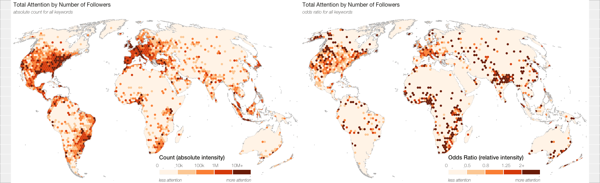

Figures (Global)
================
Ate Poorthuis
02/09/2019

Introduction
------------

To start creating our figures, we read in two datasets: a spatial datafile (in rds/`sf` format, but can read in from `geojson` or similar as well) and an attribute table containing all the necessary counts and metrics per hexagon. We join the two together based on their common id attribute.

``` r
hex_data <- readRDS(here("analysis/data/derived_data/global_hex_join_odds_ratios.rds"))
hex_sf <- readRDS(here("analysis/data/derived_data/global_hex_grid.rds")) %>% 
  left_join(., hex_data, by = "hex")

hex_union <- hex_sf %>% 
  st_buffer(1) %>% 
  summarise(count = n())
```

We will create the figures with ggplot. To make them look a little cleaner than the default theme, we overwrite some theme settings. These are mostly global settings but we'll overwrite them as-needed for some specific figures later.

``` r
basecolor <- "#FFF5EB"
colors <- c("#FFF5EB", "#FDD1A5", "#FD9243", "#DE4F05", "#7F2704")
breaks <- c(0, 100, 1000, 10000, 50000, 1000000)
labels <- c(" 0", "100", "1,000", "10,000", "50,000+")
font_col <- "#22211d"

## theme
map_theme <- theme(text = element_text(family = "Helvetica Neue", color = font_col),
                     panel.grid.major = element_blank(),
                     panel.grid.minor = element_blank(),
                     panel.border = element_blank(),
                     panel.background = element_blank(),
                     axis.text.x=element_blank(),
                     axis.title.x=element_blank(),
                     axis.ticks.x=element_blank(),
                     axis.text.y=element_blank(),
                     axis.title.y=element_blank(),
                     axis.ticks.y=element_blank(),
                     plot.title=element_text(hjust = 0, family = "Helvetica Neue", color = font_col, angle = 0, size = 12),
                     plot.subtitle=element_text(family = "Helvetica Neue Thin Italic", color = font_col, angle = 0, size = 10),
                     plot.caption=element_text(family = "Helvetica Neue Thin", color = font_col, angle = 0, size = 7),
                     legend.background = element_rect(fill="transparent"),
                     legend.position = c(0.675, 0.08),
                     legend.box = "horizontal")

## legend
legend <- guide_legend(keyheight = unit(4, units = "mm"),
                  keywidth = unit(70 / length(labels), units = "mm"),
                  direction = "horizontal", title.position = "top",
                  label.position="top",
                  title.theme = element_text(family = "Helvetica Neue Medium", color = font_col, angle = 0, size = 12),
                  title = "Count (absolute intensity)",
                  title.hjust = 0.0,
                  label.hjust = -0.2,
                  label.theme = element_text(family = "Helvetica Neue Thin", color = font_col, angle = 0, size = 10),
                  nrow = 1,
                  byrow = T)

## color scale
scale_fill <- scale_fill_manual(values=colors, guide = legend, labels = labels)
```

Figure 2
--------

The total attention to fashion world-wide - based on absolute count for all keywords.

``` r
fig2 <- hex_sf %>% 
  filter(total > 10) %>% 
  ggplot() +
  ylim(c(-6000148, 8248865)) + xlim(c(-10097010, 14597010)) +
  geom_sf(data = hex_union, fill = basecolor, color = NA) +
  geom_sf(aes(fill = cut(total, breaks=breaks, include.lowest = T)), color = NA) +
  scale_fill +
  geom_sf(data = hex_union, fill = NA, color = "gray75", size = 0.1) +
  coord_sf(datum = NA) +
  map_theme +
  labs(title = "Total Attention to Fashion", subtitle = "absolute counts for all keywords")

fig2 <- geographyoffashion::annotate_legend(fig2, label1 = "more attention", label2 = "less attention")
plot(fig2)
```


``` r
#ggsave(plot = fig2, filename = "Figure2.pdf", width = 9, height = 5.5, dpi = 600, device = cairo_pdf)
```

Figure 4
--------

The relative intensity/attention to fashion world-wide - based on the odds ratio. N.B. we use a random global sample of tweets to calculate the odds ratio here (see manuscript for details).

``` r
breaks <- c(0, 0.5, 0.8, 1/0.8, 1/0.5, 100000000)
labels <- c("0", "0.5", "0.8", "1.25", "2+")
legend <- guide_legend(keyheight = unit(4, units = "mm"),
                  keywidth = unit(70 / length(labels), units = "mm"),
                  direction = "horizontal", title.position = "top",
                  label.position="top",
                  title.theme = element_text(family = "Helvetica Neue Medium", color = "#22211d", angle = 0, size = 12),
                  title = "Odds Ratio (relative intensity)",
                  title.hjust = 0.0,
                  label.hjust = -0.2,
                  label.theme = element_text(family = "Helvetica Neue Thin", color = "#22211d", angle = 0, size = 10),
                  nrow = 1,
                  byrow = T)
scale_fill <- scale_fill_manual(values=colors, guide = legend, labels = labels)

fig4 <- hex_sf %>% 
  filter(total > 10) %>% 
  ggplot() +
  ylim(c(-6000148, 8248865)) + xlim(c(-10097010, 14597010)) +
  geom_sf(data = hex_union, fill = basecolor, color = NA) +
  geom_sf(aes(fill = cut(total_ORc, breaks=breaks, include.lowest = T)), color = NA) +
  scale_fill +
  geom_sf(data = hex_union, fill = NA, color = "gray75", size = 0.1) +
  coord_sf(datum = NA) +
  map_theme +
  labs(title = "Total Attention to Fashion", subtitle = "odds ratio for all keywords")


fig4 <- geographyoffashion::annotate_legend(fig4, label1 = "more attention", label2 = "less attention")
plot(fig4)
```


``` r
#ggsave(plot = fig4, filename = "Figure4.png", width = 9, height = 5.5, dpi = 600)
```

Figure 5
--------

Total attention to “creatives,” “business,” and “marketing” subsectors of the fashion industry (odds ratio).

``` r
p1 <- hex_sf %>% 
  filter(total > 10) %>% 
  ggplot() +
  ylim(c(-6000148, 8248865)) + xlim(c(-10097010, 14597010)) +
  geom_sf(data = hex_union, fill = basecolor, color = NA) +
  geom_sf(aes(fill = cut(creatives_ORc, breaks=breaks, include.lowest = T)), color = NA) +
  scale_fill +
  geom_sf(data = hex_union, fill = NA, color = "gray75", size = 0.1) +
  coord_sf(datum = NA) +
  map_theme +
  labs(title = "Creatives")

p2 <- hex_sf %>% 
  filter(total > 10) %>% 
  ggplot() +
  ylim(c(-6000148, 8248865)) + xlim(c(-10097010, 14597010)) +
  geom_sf(data = hex_union, fill = basecolor, color = NA) +
  geom_sf(aes(fill = cut(business_ORc, breaks=breaks, include.lowest = T)), color = NA) +
  scale_fill +
  geom_sf(data = hex_union, fill = NA, color = "gray75", size = 0.1) +
  coord_sf(datum = NA) +
  map_theme +
  labs(title = "Business")

p3 <- hex_sf %>% 
  filter(total > 10) %>% 
  ggplot() +
  ylim(c(-6000148, 8248865)) + xlim(c(-10097010, 14597010)) +
  geom_sf(data = hex_union, fill = basecolor, color = NA) +
  geom_sf(aes(fill = cut(marketing_ORc, breaks=breaks, include.lowest = T)), color = NA) +
  scale_fill +
  geom_sf(data = hex_union, fill = NA, color = "gray75", size = 0.1) +
  coord_sf(datum = NA) +
  map_theme +
  labs(title = "Marketing")

g <- geographyoffashion::grid_arrange_shared_legend(p1, p2, p3)
plot(g)
```


``` r
#ggsave(plot = g, filename = "Figure5.png", width = 9, height = 16.5, dpi = 300)
```

Figure 6
--------

Shannon diversity index of fashion attention.

``` r
breaks <- c(0, 1, 2, 3, 3.5, 100000000)
labels <- c("0", "1", "2", "3", "3.5")
legend <- guide_legend(keyheight = unit(4, units = "mm"),
                  keywidth = unit(70 / length(labels), units = "mm"),
                  direction = "horizontal", title.position = "top",
                  label.position="top",
                  title.theme = element_text(family = "Helvetica Neue Medium", color = "#22211d", angle = 0, size = 12),
                  title = "Diversity (Shannon index)",
                  title.hjust = 0.0,
                  label.hjust = -0.2,
                  label.theme = element_text(family = "Helvetica Neue Thin", color = "#22211d", angle = 0, size = 10),
                  nrow = 1,
                  byrow = T)
scale_fill <- scale_fill_manual(values=colors, guide = legend, labels = labels)

fig6 <- hex_sf %>% 
  filter(total > 10) %>% 
  ggplot() +
  ylim(c(-6000148, 8248865)) + xlim(c(-10097010, 14597010)) +
  geom_sf(data = hex_union, fill = basecolor, color = NA) +
  geom_sf(aes(fill = cut(divShannon, breaks=breaks, include.lowest = T)), color = NA) +
  scale_fill +
  geom_sf(data = hex_union, fill = NA, color = "gray75", size = 0.1) +
  coord_sf(datum = NA) +
  map_theme +
  labs(title = "Total Attention to Fashion", subtitle = "diversity for all keywords")


fig6 <- geographyoffashion::annotate_legend(fig6, label1 = "more diversity", label2 = "less diversity")
plot(fig6)
```


``` r
#ggsave(plot = fig4, filename = "Figure6.png", width = 9, height = 5.5, dpi = 600)
```

Figure 7
--------

Total attention by number of followers. (A) Absolute counts for all keywords and (B) odds ratios for all keywords.

``` r
breaks <- c(0, 0.5, 0.8, 1/0.8, 1/0.5, 100000000)
labels <- c("0", "0.5", "0.8", "1.25", "2+")
legend <- guide_legend(keyheight = unit(4, units = "mm"),
                  keywidth = unit(70 / length(labels), units = "mm"),
                  direction = "horizontal", title.position = "top",
                  label.position="top",
                  title.theme = element_text(family = "Helvetica Neue Medium", color = "#22211d", angle = 0, size = 12),
                  title = "Odds Ratio (relative intensity)",
                  title.hjust = 0.0,
                  label.hjust = -0.2,
                  label.theme = element_text(family = "Helvetica Neue Thin", color = "#22211d", angle = 0, size = 10),
                  nrow = 1,
                  byrow = T)
scale_fill <- scale_fill_manual(values=colors, guide = legend, labels = labels)

p1 <- hex_sf %>% 
  filter(total > 10) %>% 
  filter(total_fol > 0) %>% 
  ggplot() +
  ylim(c(-6000148, 8248865)) + xlim(c(-10097010, 14597010)) +
  geom_sf(data = hex_union, fill = basecolor, color = NA) +
  geom_sf(aes(fill = cut(total_fol_ORc, breaks=breaks, include.lowest = T)), color = NA) +
  scale_fill +
  geom_sf(data = hex_union, fill = NA, color = "gray75", size = 0.1) +
  coord_sf(datum = NA) +
  map_theme +
  labs(title = "Total Attention by Number of Followers", subtitle = "odds ratio for all keywords")

p1 <- geographyoffashion::annotate_legend(p1, label1 = "more attention", label2 = "less attention")

breaks <- c(0, 10000, 100000, 1000000, 10000000, 21637898124)
labels <- c("0", "10k", "100k", "1M", "10M+")
legend <- guide_legend(keyheight = unit(4, units = "mm"),
                  keywidth = unit(70 / length(labels), units = "mm"),
                  direction = "horizontal", title.position = "top",
                  label.position="top",
                  title.theme = element_text(family = "Helvetica Neue Medium", color = "#22211d", angle = 0, size = 12),
                  title = "Count (absolute intensity)",
                  title.hjust = 0.0,
                  label.hjust = -0.2,
                  label.theme = element_text(family = "Helvetica Neue Thin", color = "#22211d", angle = 0, size = 10),
                  nrow = 1,
                  byrow = T)
scale_fill <- scale_fill_manual(values=colors, guide = legend, labels = labels)
p2 <- hex_sf %>% 
  filter(total > 10) %>% 
  filter(total_fol > 0) %>% 
  ggplot() +
  ylim(c(-6000148, 8248865)) + xlim(c(-10097010, 14597010)) +
  geom_sf(data = hex_union, fill = basecolor, color = NA) +
  geom_sf(aes(fill = cut(total_fol, breaks=breaks, include.lowest = T)), color = NA) +
  scale_fill +
  geom_sf(data = hex_union, fill = NA, color = "gray75", size = 0.1) +
  coord_sf(datum = NA) +
  map_theme +
  labs(title = "Total Attention by Number of Followers", subtitle = "absolute count for all keywords")
p2 <- geographyoffashion::annotate_legend(p2, label1 = "more attention", label2 = "less attention")
fig7 <- cbind(p2, p1, size = "first")
plot(fig7)
```



``` r
#ggsave(plot = fig7, filename = "Figure7.png", width = 18, height = 5.5, dpi = 600)
```

Figure 8
--------

Total attention to Italian fashion. (A) Absolute counts for all keywords and (B) odds ratios for all keywords.

``` r
breaks <- c(0, 0.5, 0.8, 1/0.8, 1/0.5, 100000000)
labels <- c("0", "0.5", "0.8", "1.25", "2+")
legend <- guide_legend(keyheight = unit(4, units = "mm"),
                  keywidth = unit(70 / length(labels), units = "mm"),
                  direction = "horizontal", title.position = "top",
                  label.position="top",
                  title.theme = element_text(family = "Helvetica Neue Medium", color = "#22211d", angle = 0, size = 12),
                  title = "Odds Ratio (relative intensity)",
                  title.hjust = 0.0,
                  label.hjust = -0.2,
                  label.theme = element_text(family = "Helvetica Neue Thin", color = "#22211d", angle = 0, size = 10),
                  nrow = 1,
                  byrow = T)
scale_fill <- scale_fill_manual(values=colors, guide = legend, labels = labels)

p1 <- hex_sf %>% 
  filter(total > 10) %>% 
  ggplot() +
  ylim(c(-6000148, 8248865)) + xlim(c(-10097010, 14597010)) +
  geom_sf(data = hex_union, fill = basecolor, color = NA) +
  geom_sf(aes(fill = cut(NAT_ITALY_ORc, breaks=breaks, include.lowest = T)), color = NA) +
  scale_fill +
  geom_sf(data = hex_union, fill = NA, color = "gray75", size = 0.1) +
  coord_sf(datum = NA) +
  map_theme +
  labs(title = "Total Attention to Italian Fashion")

p1 <- geographyoffashion::annotate_legend(p1, label1 = "more attention", label2 = "less attention")

breaks <- c(0, 25, 50, 100, 500, 10000000000000)
labels <- c("0", "25", "50", "100", "500+")
legend <- guide_legend(keyheight = unit(4, units = "mm"),
                  keywidth = unit(70 / length(labels), units = "mm"),
                  direction = "horizontal", title.position = "top",
                  label.position="top",
                  title.theme = element_text(family = "Helvetica Neue Medium", color = "#22211d", angle = 0, size = 12),
                  title = "Count (absolute intensity)",
                  title.hjust = 0.0,
                  label.hjust = -0.2,
                  label.theme = element_text(family = "Helvetica Neue Thin", color = "#22211d", angle = 0, size = 10),
                  nrow = 1,
                  byrow = T)
scale_fill <- scale_fill_manual(values=colors, guide = legend, labels = labels)
p2 <- hex_sf %>% 
  filter(total > 10) %>% 
  ggplot() +
  ylim(c(-6000148, 8248865)) + xlim(c(-10097010, 14597010)) +
  geom_sf(data = hex_union, fill = basecolor, color = NA) +
  geom_sf(aes(fill = cut(NAT_ITALY, breaks=breaks, include.lowest = T)), color = NA) +
  scale_fill +
  geom_sf(data = hex_union, fill = NA, color = "gray75", size = 0.1) +
  coord_sf(datum = NA) +
  map_theme +
  labs(title = "Total Attention to Italian Fashion")
p2 <- geographyoffashion::annotate_legend(p2, label1 = "more attention", label2 = "less attention")
fig8 <- cbind(p2, p1, size = "first")
plot(fig8)
```


``` r
#ggsave(plot = fig8, filename = "Figure8.png", width = 18, height = 5.5, dpi = 600)
```

Figure 9
--------

Total attention to Gucci. (A) Absolute counts and (B) odds ratio.

``` r
breaks <- c(0, 0.5, 0.8, 1/0.8, 1/0.5, 100000000)
labels <- c("0", "0.5", "0.8", "1.25", "2+")
legend <- guide_legend(keyheight = unit(4, units = "mm"),
                  keywidth = unit(70 / length(labels), units = "mm"),
                  direction = "horizontal", title.position = "top",
                  label.position="top",
                  title.theme = element_text(family = "Helvetica Neue Medium", color = "#22211d", angle = 0, size = 12),
                  title = "Odds Ratio (relative intensity)",
                  title.hjust = 0.0,
                  label.hjust = -0.2,
                  label.theme = element_text(family = "Helvetica Neue Thin", color = "#22211d", angle = 0, size = 10),
                  nrow = 1,
                  byrow = T)
scale_fill <- scale_fill_manual(values=colors, guide = legend, labels = labels)

p1 <- hex_sf %>% 
  filter(total > 10) %>% 
  ggplot() +
  ylim(c(-6000148, 8248865)) + xlim(c(-10097010, 14597010)) +
  geom_sf(data = hex_union, fill = basecolor, color = NA) +
  geom_sf(aes(fill = cut(`Associated_companies-040_ORc`, breaks=breaks, include.lowest = T)), color = NA) +
  scale_fill +
  geom_sf(data = hex_union, fill = NA, color = "gray75", size = 0.1) +
  coord_sf(datum = NA) +
  map_theme +
  labs(title = "Total Attention to Gucci")

p1 <- geographyoffashion::annotate_legend(p1, label1 = "more attention", label2 = "less attention")

breaks <- c(0, 25, 50, 100, 500, 10000000000000)
labels <- c("0", "25", "50", "100", "500+")
legend <- guide_legend(keyheight = unit(4, units = "mm"),
                  keywidth = unit(70 / length(labels), units = "mm"),
                  direction = "horizontal", title.position = "top",
                  label.position="top",
                  title.theme = element_text(family = "Helvetica Neue Medium", color = "#22211d", angle = 0, size = 12),
                  title = "Count (absolute intensity)",
                  title.hjust = 0.0,
                  label.hjust = -0.2,
                  label.theme = element_text(family = "Helvetica Neue Thin", color = "#22211d", angle = 0, size = 10),
                  nrow = 1,
                  byrow = T)
scale_fill <- scale_fill_manual(values=colors, guide = legend, labels = labels)
p2 <- hex_sf %>% 
  filter(total > 10) %>% 
  ggplot() +
  ylim(c(-6000148, 8248865)) + xlim(c(-10097010, 14597010)) +
  geom_sf(data = hex_union, fill = basecolor, color = NA) +
  geom_sf(aes(fill = cut(`Associated_companies-040`, breaks=breaks, include.lowest = T)), color = NA) +
  scale_fill +
  geom_sf(data = hex_union, fill = NA, color = "gray75", size = 0.1) +
  coord_sf(datum = NA) +
  map_theme +
  labs(title = "Total Attention to Gucci")
p2 <- geographyoffashion::annotate_legend(p2, label1 = "more attention", label2 = "less attention")
fig9 <- cbind(p2, p1, size = "first")
plot(fig9)
```


``` r
#ggsave(plot = fig9, filename = "Figure9.png", width = 18, height = 5.5, dpi = 600)
```

Figure 10
---------

Total attention to Louis Vuitton (A) Absolute counts and (B) odds ratio.

``` r
breaks <- c(0, 0.5, 0.8, 1/0.8, 1/0.5, 100000000)
labels <- c("0", "0.5", "0.8", "1.25", "2+")
legend <- guide_legend(keyheight = unit(4, units = "mm"),
                  keywidth = unit(70 / length(labels), units = "mm"),
                  direction = "horizontal", title.position = "top",
                  label.position="top",
                  title.theme = element_text(family = "Helvetica Neue Medium", color = "#22211d", angle = 0, size = 12),
                  title = "Odds Ratio (relative intensity)",
                  title.hjust = 0.0,
                  label.hjust = -0.2,
                  label.theme = element_text(family = "Helvetica Neue Thin", color = "#22211d", angle = 0, size = 10),
                  nrow = 1,
                  byrow = T)
scale_fill <- scale_fill_manual(values=colors, guide = legend, labels = labels)

p1 <- hex_sf %>% 
  filter(total > 10) %>% 
  ggplot() +
  ylim(c(-6000148, 8248865)) + xlim(c(-10097010, 14597010)) +
  geom_sf(data = hex_union, fill = basecolor, color = NA) +
  geom_sf(aes(fill = cut(`Associated_companies-056_ORc`, breaks=breaks, include.lowest = T)), color = NA) +
  scale_fill +
  geom_sf(data = hex_union, fill = NA, color = "gray75", size = 0.1) +
  coord_sf(datum = NA) +
  map_theme +
  labs(title = "Total Attention to Louis Vuitton")

p1 <- geographyoffashion::annotate_legend(p1, label1 = "more attention", label2 = "less attention")

breaks <- c(0, 25, 50, 100, 500, 10000000000000)
labels <- c("0", "25", "50", "100", "500+")
legend <- guide_legend(keyheight = unit(4, units = "mm"),
                  keywidth = unit(70 / length(labels), units = "mm"),
                  direction = "horizontal", title.position = "top",
                  label.position="top",
                  title.theme = element_text(family = "Helvetica Neue Medium", color = "#22211d", angle = 0, size = 12),
                  title = "Count (absolute intensity)",
                  title.hjust = 0.0,
                  label.hjust = -0.2,
                  label.theme = element_text(family = "Helvetica Neue Thin", color = "#22211d", angle = 0, size = 10),
                  nrow = 1,
                  byrow = T)
scale_fill <- scale_fill_manual(values=colors, guide = legend, labels = labels)
p2 <- hex_sf %>% 
  filter(total > 10) %>% 
  ggplot() +
  ylim(c(-6000148, 8248865)) + xlim(c(-10097010, 14597010)) +
  geom_sf(data = hex_union, fill = basecolor, color = NA) +
  geom_sf(aes(fill = cut(`Associated_companies-056`, breaks=breaks, include.lowest = T)), color = NA) +
  scale_fill +
  geom_sf(data = hex_union, fill = NA, color = "gray75", size = 0.1) +
  coord_sf(datum = NA) +
  map_theme +
  labs(title = "Total Attention to Louis Vuitton")
p2 <- geographyoffashion::annotate_legend(p2, label1 = "more attention", label2 = "less attention")
fig10 <- cbind(p2, p1, size = "first")
plot(fig10)
```


``` r
#ggsave(plot = fig10, filename = "Figure10.png", width = 18, height = 5.5, dpi = 600)
```
