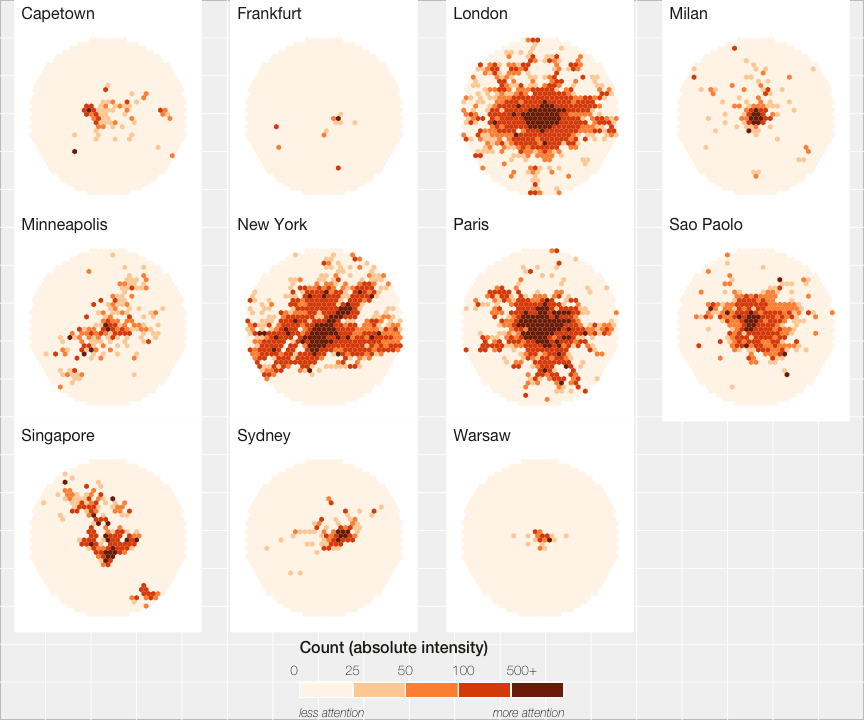
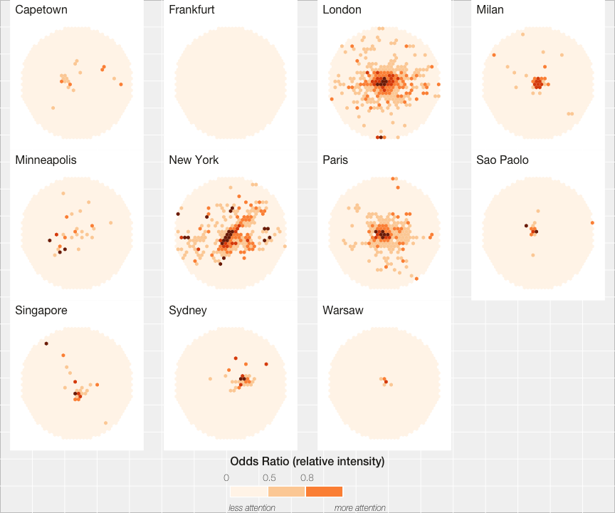

Figures (Cities)
================
Ate Poorthuis
26/10/2019

Introduction
------------

To start creating our figures, we read in two datasets: a spatial datafile (in rds/`sf` format, but can read in from `geojson` or similar as well) and an attribute table containing all the necessary counts and metrics per hexagon. We join the two together based on their common id attribute.

``` r
hex_data <- readRDS(here("analysis/data/derived_data/cities_hex_join_odds_ratios.rds"))
hex_sf <- readRDS(here("analysis/data/derived_data/cities_hex_grid.rds")) %>% 
  left_join(., hex_data, by = "hex")

hex_union <- hex_sf %>% 
  st_buffer(1) %>% 
  summarise(count = n())
```

We will create the figures with ggplot. To make them look a little cleaner than the default theme, we overwrite some theme settings. These are mostly global settings but we'll overwrite them as-needed for some specific figures later.

``` r
basecolor <- "#FFF5EB"
colors <- c("#FFF5EB", "#FDD1A5", "#FD9243", "#DE4F05", "#7F2704")
breaks <- c(0, 25, 50, 100, 500, 10000000000000)
labels <- c("0", "25", "50", "100", "500+")
font_col <- "#22211d"

## theme
map_theme <- theme(text = element_text(family = "Helvetica Neue", color = font_col),
                     panel.grid.major = element_blank(),
                     panel.grid.minor = element_blank(),
                     panel.border = element_blank(),
                     panel.background = element_blank(),
                     axis.text.x=element_blank(),
                     axis.title.x=element_blank(),
                     axis.ticks.x=element_blank(),
                     axis.text.y=element_blank(),
                     axis.title.y=element_blank(),
                     axis.ticks.y=element_blank(),
                     plot.title=element_text(hjust = 0, family = "Helvetica Neue", color = font_col, angle = 0, size = 12),
                     plot.subtitle=element_text(family = "Helvetica Neue Thin Italic", color = font_col, angle = 0, size = 10),
                     plot.caption=element_text(family = "Helvetica Neue Thin", color = font_col, angle = 0, size = 7),
                     legend.background = element_rect(fill="transparent"),
                     legend.position = c(0.675, 0.08),
                     legend.box = "horizontal")

## legend
legend <- guide_legend(keyheight = unit(4, units = "mm"),
                  keywidth = unit(70 / length(labels), units = "mm"),
                  direction = "horizontal", title.position = "top",
                  label.position="top",
                  title.theme = element_text(family = "Helvetica Neue Medium", color = font_col, angle = 0, size = 12),
                  title = "Count (absolute intensity)",
                  title.hjust = 0.0,
                  label.hjust = -0.2,
                  label.theme = element_text(family = "Helvetica Neue Thin", color = font_col, angle = 0, size = 10),
                  nrow = 1,
                  byrow = T)

## color scale
scale_fill <- scale_fill_manual(values=colors, guide = legend, labels = labels)
```

Figure 3a
---------

Total attention in selected urban locations - based on absolute count for all keywords.

``` r
plot_city <- function(city_name) {
  hex_union <- hex_sf %>% 
    filter(city.x == city_name) %>% 
    st_buffer(1) %>% 
    summarise(count = n())
  hex_sf %>% 
    filter(city.x == city_name) %>% 
    filter(total > 10) %>% 
    ggplot() +
    geom_sf(data = hex_union, fill = basecolor, color = NA) +
    geom_sf(aes(fill = cut(total, breaks=breaks, include.lowest = T)), color = NA) +
    scale_fill +
    coord_sf(datum = NA) +
    map_theme +
    labs(title = city_name)
}
plots <- purrr::map(unique(hex_sf$city.x) %>% sort(), plot_city)

fig3a <- do.call(geographyoffashion::grid_arrange_shared_legend, c(plots, list(ncol = 4, nrow = 3)))
plot(fig3a)
```



``` r
#ggsave(plot = fig3a, filename = "Figure3a.png", width = 9, height = 7.5, dpi = 600, device = cairo_pdf)
```

Figure 3b
---------

Total attention in selected urban locations - based on odds ratio for all keywords.

``` r
breaks <- c(0, 0.5, 0.8, 1/0.8, 1/0.5, 100000000)
labels <- c("0", "0.5", "0.8", "1.25", "2+")
legend <- guide_legend(keyheight = unit(4, units = "mm"),
                  keywidth = unit(70 / length(labels), units = "mm"),
                  direction = "horizontal", title.position = "top",
                  label.position="top",
                  title.theme = element_text(family = "Helvetica Neue Medium", color = "#22211d", angle = 0, size = 12),
                  title = "Odds Ratio (relative intensity)",
                  title.hjust = 0.0,
                  label.hjust = -0.2,
                  label.theme = element_text(family = "Helvetica Neue Thin", color = "#22211d", angle = 0, size = 10),
                  nrow = 1,
                  byrow = T)
scale_fill <- scale_fill_manual(values=colors, guide = legend, labels = labels)

plot_city <- function(city_name) {
   hex_union <- hex_sf %>% 
    filter(city.x == city_name) %>% 
    st_buffer(1) %>% 
    summarise(count = n())
  hex_sf %>% 
    filter(city.x == city_name) %>% 
    filter(total > 10) %>% 
    ggplot() +
    geom_sf(data = hex_union, fill = basecolor, color = NA) +
    geom_sf(aes(fill = cut(total_ORc, breaks=breaks, include.lowest = T)), color = NA) +
    scale_fill +
    coord_sf(datum = NA) +
    map_theme +
    labs(title = city_name)
}
plots <- purrr::map(unique(hex_sf$city.x) %>% sort(), plot_city)

fig3b <- do.call(geographyoffashion::grid_arrange_shared_legend, c(plots, list(ncol = 4, nrow = 3)))
plot(fig3b)
```



``` r
#ggsave(plot = fig3b, filename = "Figure3b.png", width = 9, height = 7.5, dpi = 600, device = cairo_pdf)
```
